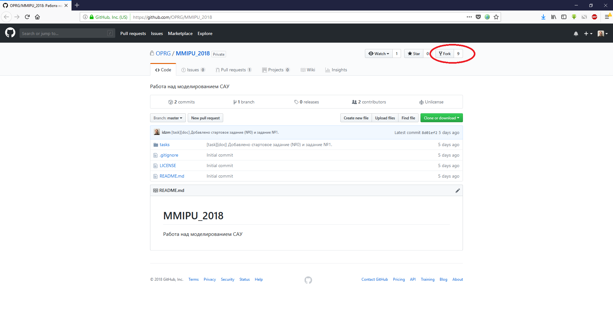
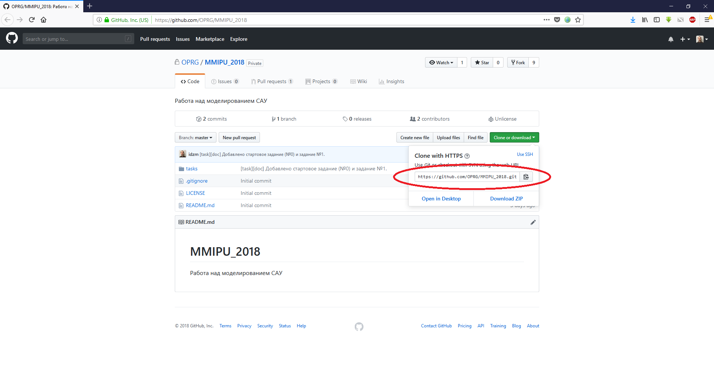
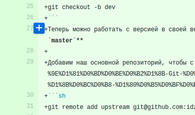
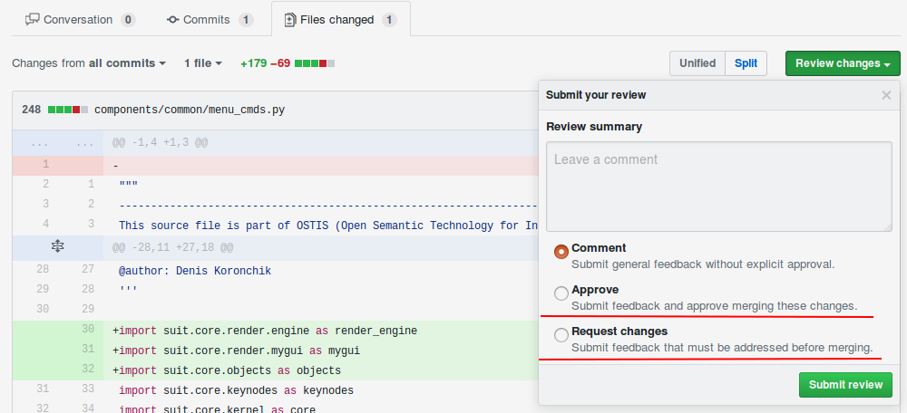

# Участие в проекте с использованием сервиса [GitHub](https://www.Github.com/) #
## Принципы работы с репозиторием ##

Прежде чем начать работу с репозиторием, необходимо сделать его клон. Для этого необходимо нажать кнопку `Fork` в правом верхнем углу экрана:



Если появилось окно с выбором организации, то следует выбрать свой профиль.

После этого клонируем себе свой форк репозитория:



Команда для клонирования:
```sh
git clone https://github.com/<your account name>/MMIPU_2018.git
```

Далее будет описаны основные команды и ситуации при работе с репозиторием, все они доступны и в различных GUI инструментах:
- [TortoiseGit ](https://tortoisegit.org/) - интеграция git для Windows;
- [GitKraken](https://www.gitkraken.com/) - хороший инструмент, который работает на Windows, Linux, OSX;
- [GitX-dev](https://rowanj.github.io/gitx/) - отличный инструмент для OSX;
- огромный [список](https://git.wiki.kernel.org/index.php/Interfaces,_frontends,_and_tools#Graphical_Interfaces) различных инструментов.

Чтобы удобно было работать, сразу стоит сделать себе ветку для работы:
```sh
git checkout -b dev
```
Теперь можно работать с версией в своей ветке `dev`. **Настоятельно рекомендуется использовать ветку для разработки, а не `master`**

Добавим наш основной репозиторий, чтобы с него можно было обновляться (более [подробно](https://git-scm.com/book/ru/v1/Основы-Git-Работа-с-удалёнными-репозиториями) про команды):
```sh
git remote add upstream https://github.com/OPRG/MMIPU_2018.git
```

**Важно:** используйте следующие имена для `remote` ссылок:
- `upstream` - основной репозиторий (центральный), на нем всегда стабильная версия в `master`;
- `origin` - ваш `fork` основного репозитория.

Разделение на `upstream` и `origin` позволяет вам не бояться "сломать" что-либо в основном репозитории. Так как вся ваша работа будет происходить с `fork`-ом.

Далее будет ряд команд, которые позволят получать обновления и работать с основным репозиторием:
- обновление вашей текущей версии до последнего состояния:
```sh
git checkout master       # переключаемся на ветку master
git remote update         # обновляем все remote
git merge upstream/master # переносим в наш локальный мастер все изменения
git push origin master    # пушим в наш форк свежий master
git checkout dev          # переключаемся на нашу рабочую ветку
git rebase master         # переносим изменения из мастера в нашу ветку
```
Для переноса изменений мы используем `rebase` - это позволяет сделать историю изменений легкой для чтения (более подробно можно почитать [тут](https://git-scm.com/book/ru/v1/Ветвление-в-Git-Перемещение) или [тут](https://habrahabr.ru/post/161009/)). Если интересно чем это лучше `merge` то можно почитать эту [статью](https://www.atlassian.com/git/tutorials/merging-vs-rebasing).

## Создание и оформление commit-ов ##

Каждый `commit` в репозиторий должен быть атомарным и иметь комментарий. Атомарность коммита заключается в том, что в нем находятся изменения в рамках одной задачи. Например: не стоит делать в одном коммите две такие вещи - переименование термина `x` в термин `y`; удаление ненужных файлов.

Стоит из этого сделать два отдельных коммита:
- переименование термина `x` в термин `y`;
- удаление ненужных файлов.

Каждый коммит НЕ должен приводить систему в "сломанное" состояние. После каждого из них она должна работать.

Чтобы упростить навигацию по истории к коммитам необходимо приписывать метки
```
[метка] Содержание коммита (#issue)
[метка1][метка2] Содержание коммита (#issue)
```

Возможные варианты меток:
- `fix` - когда были исправления в имеющихся исходниках;
- `test` - добавление и изменения в unit-тестах;
- `doc` - изменения в документации;
- `img` - изменения в фотографиях;
- `config` - изменения в конфигурационных файлах и файлах поддержки репозитория (например: `.gitignore`);
- `review` - изменения по комментариям после review.

Например:
- исправили ошибки в БЗ тогда коммит выглядит так:
```
[img][fix] Исправлена ошибка в изображении (#38)  // где #38 ссылка на issue
```
- добавили в БЗ новые файлы и тесты к ним:
```
[img][test] Добавлено описание формата X
```

Таким образом разработчик, глядя на историю будет понимать, что меняется и где.

## Pull requests ##

[Официальная документация](https://help.github.com/articles/creating-a-pull-request) по созданию Pull request.

К *pull requests* применяются следующие правила:
- создается из своей ветки на ветку `master` в основном репозитории;
- автор НЕ имеет права делать `merge` своему *merge request*;
- *pull request* должен быть просмотрен как минимум 1-м человеком;
- если имеются автоматические тесты, то мержить *pull request* с НЕ работающими автоматическими тестами **строго запрещено**;
- просматривать *pull request* могут все желающие и высказывать свое мнение по нему или отдельным его частям;
- *pull request* принимается, когда все кто участвует в дискуссии пришли к "общему знаменателю".

Рецензия:
- для написания комментариев к исходникам в *pull request*, необходимо перейти на вкладку `Changes` и добавлять комментарии к необходимым строкам:

;
- если ревьювер считает что *merge request* можно мержить и нет необходимых правок, то он делает `Approve`. Если же требуются изменения, то `Request changes`:



## Именование документов ##

Все документы должны иметь краткое точное название (на английском языке), отражающее содержимое документа.

При большом количестве документов четкого разделения документация разбивается по каталогам. Примеры названий каталогов:
- Description
- Manual
- Scheme
- Report

Возможно также использование других необходимых названий.

## Использование Мarkdown ##

Данный облегчённый язык разметки повсеместно используется (для написания документации - *.md файла, комментариев и т.д.). Его подробное описание находится [здесь](https://help.github.com/articles/about-writing-and-formatting-on-github/).