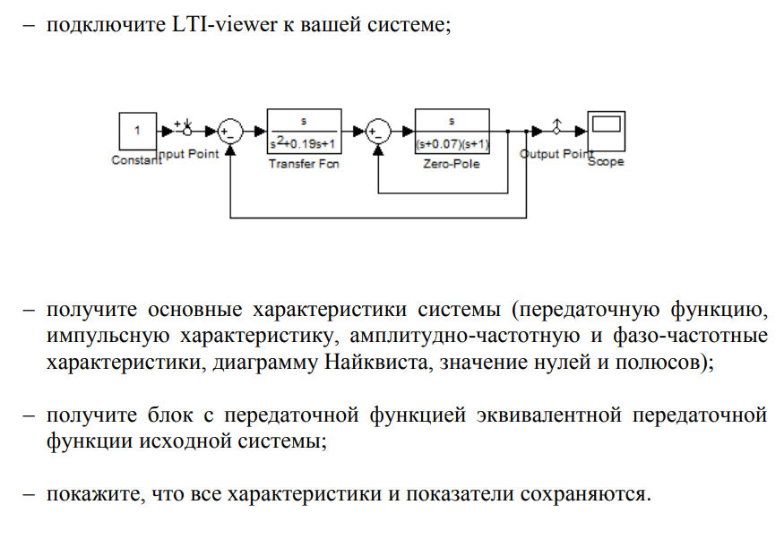
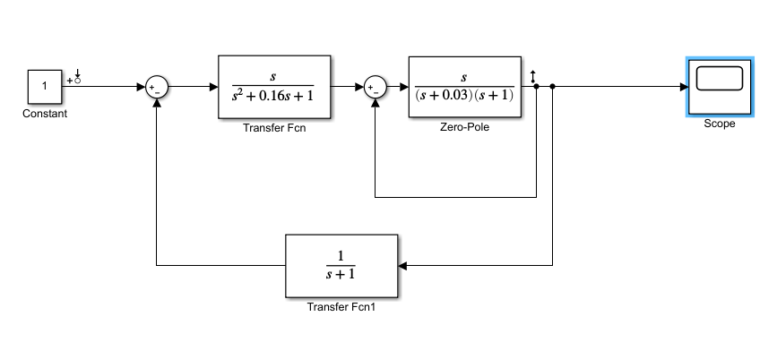
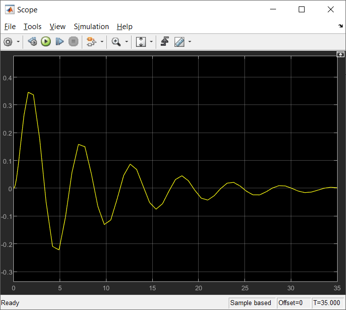
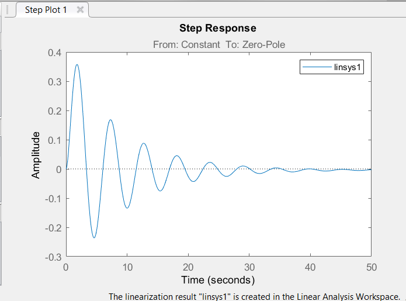
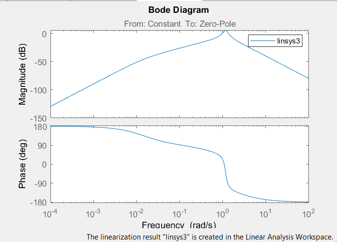
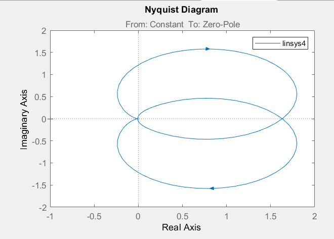
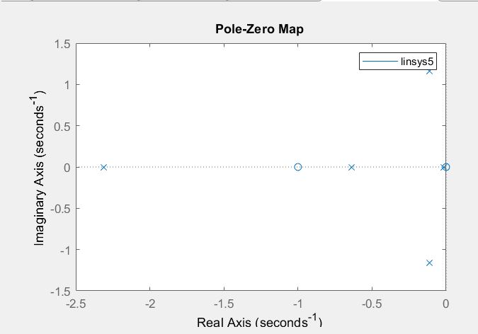

# Лабораторная работа №3

#### Студент: Храповицкий Олег

###### Task 3. Модель системы с сложной передаточной функцией
**Цель:** 
1) научиться строить в Simulink модель системы с сложной структурой с обратными связями; 
2) Освоить использование LTI-viewer.

**Задание:**

    

**Выполнение:**

Запустили Matlab и в нем Simulink, затем открыл новое окно модели и построил модель системы следующего вида:

    

На осциллографе (Scope) получили переходную функцию системы.

    

Подключили LTI-viewer к системе.
Основные характеристики системы: 

1) передаточная функция

    

Система устройчива, т.к. функция стремится к 0.

2) импульсная характеристика

    

3) амплитудно-частотная и фазо-частотная характеристики

    

4) диаграмма Найквиста

    

Система устойчива, т.к. точка (0;-1) не принадлежит области.

5) значение нулей и полюсов

    

Система устройчива – полюса находятся в отрицательной области (2,3 четверти).

**Вывод:** в ходе лабораторной работы научились строить в Simulink модель системы с сложной структурой с обратными связями, а также освоили использование LTI-viewer.
