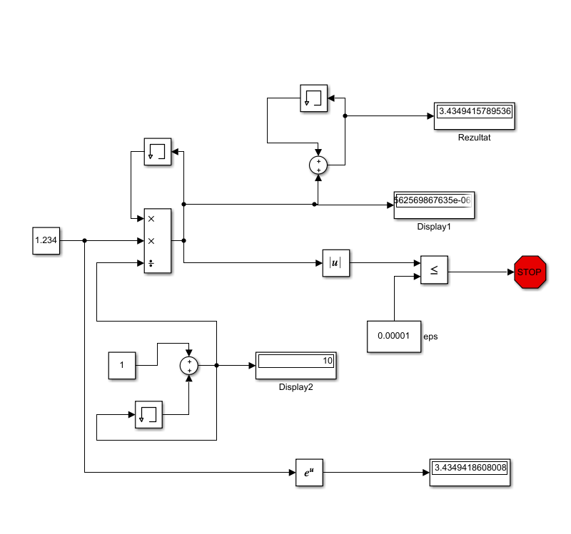
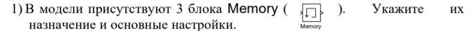
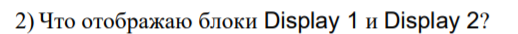
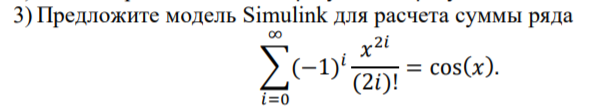
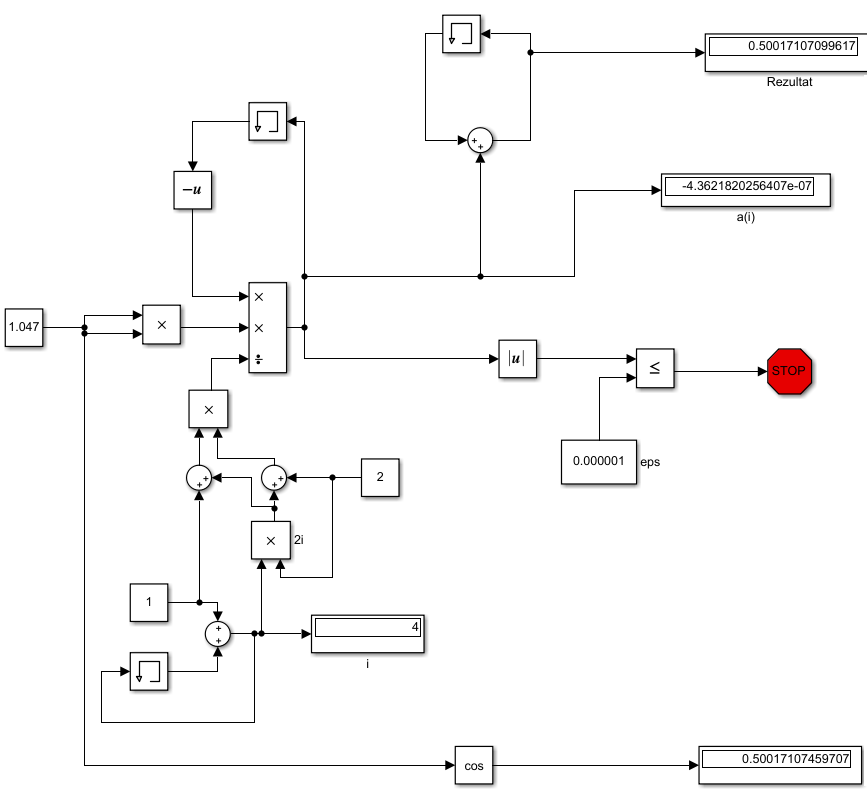

# Лабораторная работа №1

#### Студент: Храповицкий Олег

###### Task 1. Знакомство с Simulink
Пример 1:

    

Пример 2:

    

Задания:

    

Блок memory используется для хранения предыдущей переменной для расчета по формуле

    

<b>Display1</b> отображает последнюю переменную a(i)

<b>Display2</b> отображает наше количество итераций – i

    

    

