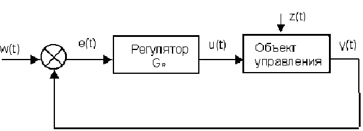
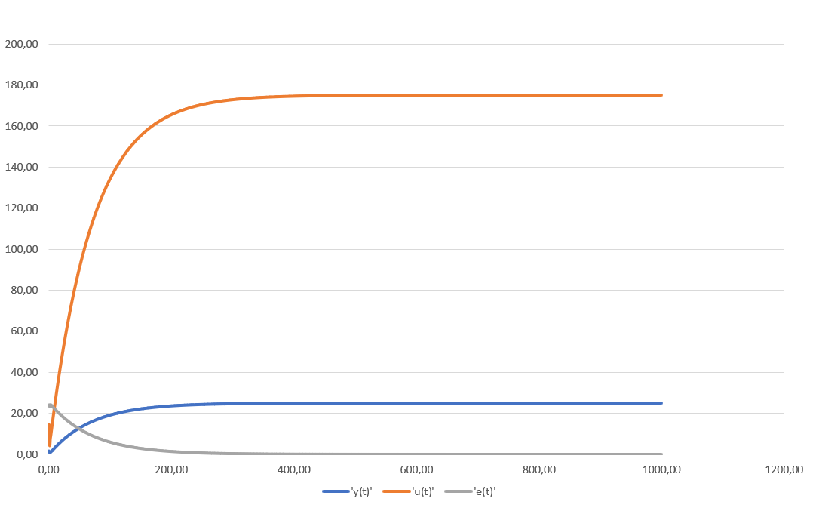
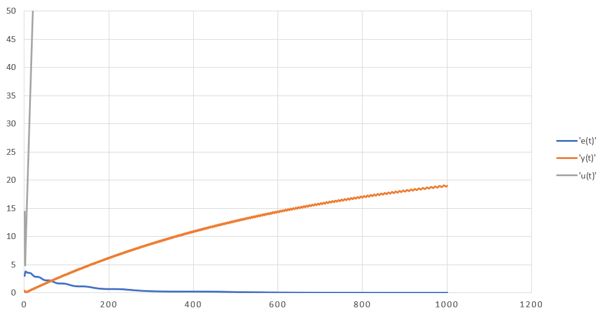
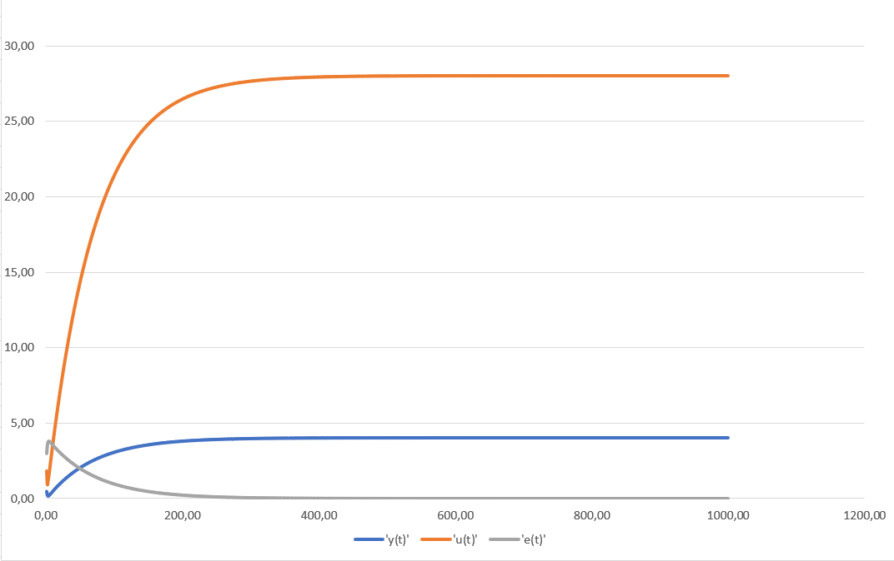
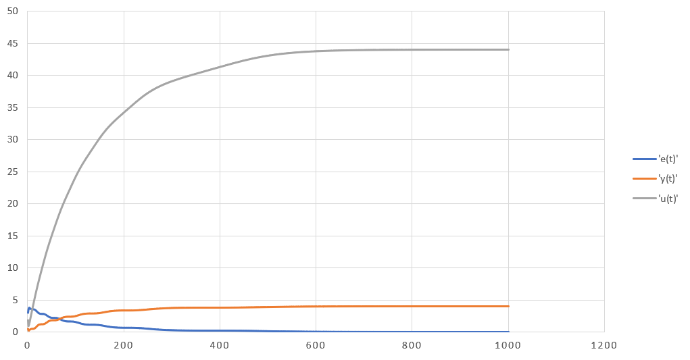

# Laboratory work #2
### Completed by the 3rd year student of
### Faculty of Electronic-Information Systems
### the group АС-54и, Safrin A. A.
### Checked by Ivanyuk D. S. 
##### Task:
Write program (C++), that models PID - controller.

PID - controller:

<p align="center">
    
</p>


##### Code:

```c++
#include<iostream>
#include<math.h>
#include<fstream>

/**
	\file in this file i solve task to implement PID - controller
	\authors Alexander Safrin
	\version 1.0
	\date 21.10.2020

*/

using namespace std;

/*!
	\brief class that implements Object of Control

	abstract class to set needed functions
*/
class Model
{
public:
	/*!
		abstract function to override in child classes
		\param InputWarm output of Controller
	*/
	virtual float equation(double InputWarm) = 0;
};


/*!
	\brief class that implements Object of Control

	this class extends parent class Model and implements Linear Model
*/
class Linear : public Model {
private:
	float a, b;///< Coefficients for Linear class
	double Y = 0;///< Inital value for Yt
public:
	/*!
		Constructor for NonLinear class
		\param a,b coefficients
		\param Y initial value of Yt
	*/
	Linear(const float a, const float b, const double Y) {
		this->a = a;
		this->b = b;
		this->Y = Y;
	}

	/*!
		it calculate Yt via linear method
		\param ImputWarm output of Controller
		\return input parameter to Object of Control Yt
	*/
	float equation(double InputWarm) override {
		//cout << " " << Y;
		Y = a * Y + b * InputWarm;
		return Y;
	}
};

/*!
	\brief class that implements Object of Control

	this class extends parent class Model and implements Nonlinear Model
*/
class NonLinear : public Model {
private:
	float a, b, c, d; ///< Coefficients for Linear class
	double Y = 0; ///< Inital value for Yt
	double Yprev = 0; ///< Variable to store previous Yt
	double Ynext = 0; ///< Variable to store next Yt
	double InputWarmPrev = 0; ///< Variable to store previous InputWarm
public:
	/*!
		Constructor for NonLinear class
		\param a,b,c,d coefficients
		\param Y initial value of Yt
	*/
	NonLinear(const float a, const float b, const float c, const float d, const float Y) {
		this->a = a;
		this->b = b;
		this->c = c;
		this->d = d;
		this->Y = Y;
	}
	/*!
		it calculate Yt via nonlinear method
		\param ImputWarm output of Controller
		\return input parameter to Object of Control Yt
	*/
	float equation(double InputWarm) override {
		Ynext = a * Y - b * pow(Yprev, 2) + c * InputWarm + d * sin(InputWarmPrev);

		Yprev = Y;
		Y = Ynext;
		InputWarmPrev = InputWarm;

		return Ynext;
	}

};

/*!
	\brief class that implements Controller Gr
*/
class Controller { 
private:
	double InputWarm = 0;
	double K, T0, TD, T;
public:
	/*!
		Constructor for Controller class
		\param K,T0,TD,T coefficients
	*/
	Controller(const double K, const double T0, const double TD, const double T) {
		this->K = K;
		this->T0 = T0;
		this->TD = TD;
		this->T = T;
	}
	/*!
		\brief function that calculate u(t) and returns it
		\param E,Eprev,Eprevprev values of current, previous and the before previous one errors
		\return InputWarm u(t)
	*/
	double getImputWarm(const double E, const double Eprev = 0, const double Eprevprev = 0) {
		double q0 = K * (1.0 + TD / T0);
		double q1 = -K * (1 + 2.0 * TD / T0 - T0 / T);
		double q2 = K * TD / T0;
		InputWarm += q0 * E + q1 * Eprev + q2 * Eprevprev;
		return InputWarm;
	}

};


/*!
	\brief function that models PID controller
	\param w some desired value
	\param *reg pointer on Controller instance
	\param *lm pointer on some Model instance
	\param Yinit initial value of Yt
*/
void PIDRegulator(const double w,Controller *reg, Model *lm,double Yinit) {
	double E = 0.0, Eprev = 0.0, Eprevprev = 0.0;
	double u = 0, y = Yinit;
	//ofstream foutE("E.txt");
	//ofstream foutU("U.txt");
	//ofstream foutY("Y.txt");
	for (int k = 0; k < 10000; k++) {
		E = w - y;
		u = reg->getImputWarm(E, Eprev, Eprevprev);
		y = lm->equation(u);
		
		//cout << E << " " << y << " " << u << endl;
		//foutE << E << endl;
		//foutU << u << endl;
		//foutY << y << endl;


		Eprevprev = Eprev;
		Eprev = E;
	}
	//foutE.close();
	//foutU.close();
	//foutY.close();
}


/// \brief creations of all class' instances and call of PIDRegulator functions
int main() {
	Linear *m = new Linear(0.3, 0.1, 1);
	Controller* r = new Controller(0.1, 10, 50, 10);
	PIDRegulator(25, r, m, 1);

	cout << "\n\n\n\n";

	NonLinear* nlm = new NonLinear(0.3, 0.0001, 0.01, 0.1, 1);
	Controller* nlr = new Controller(0.1, 10, 50, 10);

	PIDRegulator(25, nlr, nlm, 1);
	return 0;
}
```

##### Result:
```w(t) = 4 K = 0.1 T0 = 10 TD = 50 T = 10```

##### Linear
 ```a = 0.3 b = 0.1```
<p align="center">
    
</p>

##### Nonlinear
```a = 0.3 b = 0.1 c = 0.1 d = 0.1```
<p align="center">
    
</p>


```w(t) = 25 K = 0.1 T0 = 10 TD = 50 T = 10```
##### Linear
 ```a = 0.3 b = 0.1```
<p align="center">
    
</p>


##### Nonlinear
```a = 0.3 b = 0.0001 c = 0.01 d = 0.1```
<p align="center">
    
</p>
