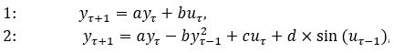
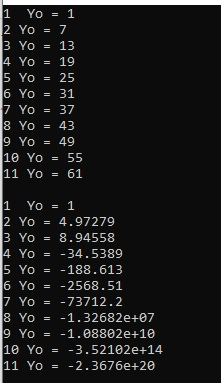

# Лабораторная работа
## Альциванович Н.В.

```
#include <iostream>

using namespace std;

void lineare(float a, float b, float y0, float ut, int time) {
	cout << "1 " << " Yo = " << y0 << endl;
	for (int i = 0; i < time; i++) {
		y0 = a * y0 + b * ut;
		cout << i + 2 << " Yo = " << y0 << endl;
	}
	cout << endl;
}
void nonlineare(float a, float b, float c, float d, float y0, float ut, float ut1, float time) {
	float lastY = y0;
	float y = 0;
	cout << "1 " << " Yo = " << y0 << endl;
	for (int i = 0; i < time; i++) {
		y = y0;
		y0 = a * y0 - b * pow(lastY, 2) + c * ut + d * sin(ut1);
		lastY = y;
		cout << i + 2 << " Yo = " << y0 << endl;
	}
	cout << endl;
}

int main() {
	float a = 1;
	float b = 2;
	float c = 3;
	float d = 4;
	float ut = 3;
	float y0 = 1;
	int time = 10;
	float ut1 = 4;
	lineare(a, b, y0, ut, time);
	nonlineare(a, b, c, d, y0, ut, ut1, time);
	return 0;

}
```

