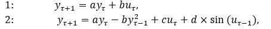

# Laboratory work #1

#### Student: Dmitriy Brashavets

###### Task 1. Modeling controlled object

Write program (C++), which simulate object temperature.

Linear and nonlinear models:

<p align="center">
    
</p>


##### Code:

```c++
#include <iostream>
#include <string>
#include "math.h"

using namespace std;

double linear(double yt, double a, double b, double ut) { //function of linear simulation
    return a * yt + b * ut; // returning result of calculating
}

double nonlinear(double lastYt, double grandLastYt, double lastUt, double grandLastUt, double a, double b, double c, double d) { //function of nonlinear simulation
    return a * lastYt - b * grandLastYt * grandLastYt + c * lastUt + d * sin(grandLastUt); // returning result of calculating
}

int main() {
    double y0, u0, aL, bL, aN, bN, cN, dN, yKey, yKey2, uKey, uKey2; //variables declaration
    int numOfLinearIterations, numOfNonlinearIterations; //variables declaration
    
    cout << "Enter started value of y: "; cin >> y0; //getting values of constants from user
    cout << "Enter started value of u: "; cin >> u0;
    
    cout << endl << "Linear parametrs" << endl;
    cout << "Enter value of a-parameter: "; cin >> aL;
    cout << "Enter value of b-parameter: "; cin >> bL;
    
    cout << endl << "Nonlinear parametrs" << endl;
    cout << "Enter value of a-parameter: "; cin >> aN;
    cout << "Enter value of b-parameter: "; cin >> bN;
    cout << "Enter value of c-parameter: "; cin >> cN;
    cout << "Enter value of d-parameter: "; cin >> dN; 
    
    cout << endl << "Number of iterations" << endl;
    cout << "Linear: "; cin >> numOfLinearIterations; //getting number of iterations from user
    cout << "Nonlinear: "; cin >> numOfNonlinearIterations;
    
    cout << endl << endl << "Linear simulation" << endl; //linear simulation
    yKey = y0; uKey = u0;
    cout << "Iteration" << "\t" << "Yt";
    for (int iterator = 0; iterator < numOfLinearIterations; iterator++) {
        cout << endl << "Enter Ut: "; cin >> uKey; //getting Ut value from user
        yKey = linear(yKey, aL, bL, uKey); //calculating new value of Yt
        cout << iterator + 1 << "\t" << "\t" << yKey; //output
    }

    cout << endl << endl << "Nonlinear simulation" << endl; //nonlinear simulation
    yKey = y0; uKey = u0;
    cout << "Iteration" << "\t" << "Yt";
    for (int iterator = 0; iterator < numOfLinearIterations; iterator++) {
        if (iterator > 0) { //checking is this zero-iteration
            uKey2 = uKey; yKey2 = yKey; //passing data from Yt to Yt-1
            cout << endl << "Enter Ut: "; cin >> uKey; //getting Ut value from user
            yKey = nonlinear(yKey, yKey2, uKey, yKey2, aN, bN, cN, dN); //calculating new value of Yt
            cout << iterator + 1 << "\t" << "\t" << yKey; //output
        }
        else {
            uKey2 = 0; yKey2 = 0; //initializing Yt-1 and Ut-1 values
            cout << endl << "Enter Ut: "; cin >> uKey; //getting Ut value from user
            yKey = nonlinear(yKey, yKey2, uKey, yKey2, aN, bN, cN, dN); //calculating new value of Yt
            cout << iterator + 1 << "\t" << "\t" << yKey; //output
        }
    }
}

```

##### Result:
<p align="center">
    
</p>
<p align="center">
    
</p>