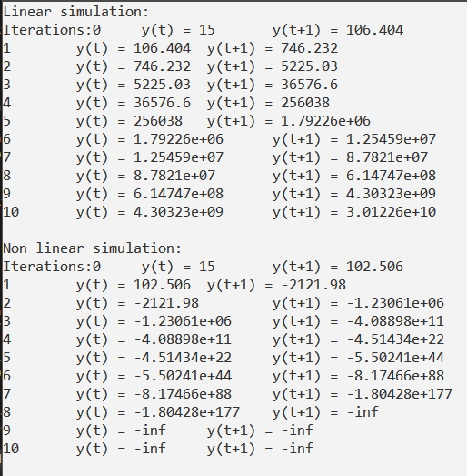

# Laboratory work #1

#### Student: Daniliuk Vladislav

###### Task 1. Modeling controlled object

Write program (C++), which simulate object temperature.

Linear and nonlinear models:

<p align="center">
    
</p>

##### Code:

```
#include <iostream>

using namespace std;
void linear(double a, double b, double u, double y) {
    cout << "Iterations:";
    for (int i = 0; i <= 10; ++i) {
        cout << i << "\t y(t) = " << y;
        y = a * y + b * u;
        cout << "\t y(t+1) = " << y << endl;
    }
}


void nonLinear(double a, double b, double c, double d, double u, double y) {
    double y0 = 0;
    cout << "Iterations:";
    for (int i = 0; i <= 10; ++i) {
        cout << i << "\t y(t) = " << y;
        y = a * y - b * y0 * y0 + c * u + d * sin(u);
        cout << "\t y(t+1) = " << y << endl;
        y0 = y;
    }
}


int main() {
    cout << "Linear simulation:" << endl;
    linear(7, 0.27, 5.2, 15);
    cout << "\n";
    cout << "Non linear simulation:" << endl;
    nonLinear(7, 0.27, 0.2, 4, 5.2, 15);
    return 0;
}
```

##### Result:

<p align="center">
    
</p>
