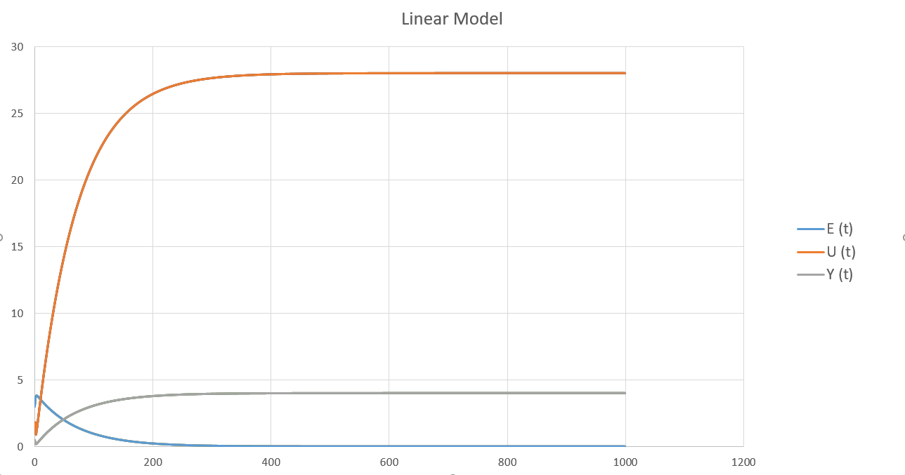
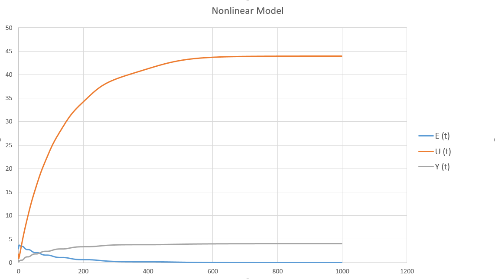

# Laboratory work #2

#### Student: Daniliuk Vladislav

###### Task 2. PID controller
In C ++, implement a program that simulates the PID controller discussed above.
Use the mathematical model obtained in the previous work as a control object.
Use OOP, the program must have at least 3 classes (+ inheritance).
The report also contains graphs for different tasks of the object temperature,
explain the results obtained (the report can be obtained using Doxygen in chm format).


##### Code:

```c++
#include<iostream>
#include<math.h>

using namespace std;

class Model {
public:
	virtual double equation(double u, double y) = 0;
};

class Linear : public Model {
private:
	double a, b;

public:
	Linear(const double a, const double b);
	double equation(double u, double y) override;
};

Linear::Linear(const double a, const double b) {
	this->a = a;
	this->b = b;
}
double Linear::equation(double u, double y) {
	y = a * y + b * u;
	return y;
}

class Regulator {
private:
	double u = 0;
	double K, T, TD, T0;
public:
	Regulator(const double K, const double T0, const double TD, const double T);
	double BeginWarm(const double e, const double e0 = 0, const double e00 = 0);
	void PIDRegulator(const double w, Regulator* reg, Model* m, double y);
};

Regulator::Regulator(const double K, const double T0, const double TD, const double T) {
	this->K = K;
	this->T0 = T0;
	this->TD = TD;
	this->T = T;
}
double Regulator::BeginWarm(const double e, const double e0, const double e00) {
	double q0 = K * (1.0 + TD / T0);
	double q1 = -K * (1 + 2.0 * TD / T0 - T0 / T);
	double q2 = K * TD / T0;
	u += q0 * e + q1 * e0 + q2 * e00;
	return u;
}

void Regulator::PIDRegulator(const double w, Regulator* reg, Model* m, double y) {
	double e = 0.0, e0 = 0.0, e00 = 0.0;
	double u = 0;
	for (int k = 0; k < 50; k++) {
		std::cout << e << "\t|\t" << y << "\t|\t" << u << std::endl;
		e = w - y;
		u = reg->BeginWarm(e, e0, e00);
		y = m->equation(u, y);
		e00 = e0;
		e0 = e;
	}
}

class NonLinear : public Model {
private:
	double a, b, c, d;
	double y0 = 0, u0 = 0;
public:
	NonLinear(double a, double b, double c, double d);
	double equation(double u, double y) override;
};

NonLinear::NonLinear(double a, double b, double c, double d) {
	this->a = a;
	this->b = b;
	this->c = c;
	this->d = d;
}
double NonLinear::equation(double beginWarm, double y) {
	double y1 = a * y - b * pow(y0, 2) + c * beginWarm + d * sin(u0);
	y0 = y;
	u0 = beginWarm;
	return y1;
}

int main() {
	cout << "Linear model:\nE:\t\tY:\t\tU:\n\n";
	Linear* model = new Linear(0.3, 0.1);
	Regulator* r = new Regulator(0.1, 10, 50.0, 10.0);
	r->PIDRegulator(25, r, model, 0);

	cout << "\n\nNonlinear model:\nE:\t\tY:\t\tU:\n\n";

	NonLinear* n_model = new NonLinear(0.3, 0.1, 0.1, 0.1);
	Regulator* nlr = new Regulator(0.1, 10, 50.0, 10.0);
	r->PIDRegulator(25, nlr, n_model, 0);

	return 0;
}
```

##### Result:
w(t) = 4 K = 0.1 T0 = 10 TD = 50 T = 10

linear 
   <p>
    
</p>
Nonlinear equation
<p>
    
</p>
