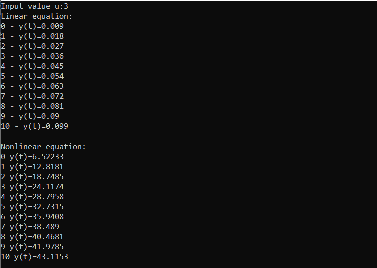

**Student: Demidovich Anna AS-53**
_Task 1.
Modeling controlled object. Write program (C++). With help Linear and Nonlinear models._


**Program code:**

```
#include <iostream>

using namespace std;

int main()
{

	float a = 1, c = 2, d = 3, b = 0.003;
	float y = 0;
	float y1 = 0;
	float u = 0; float uPrev = 0;
	int n = 10;
	float yPrev = 0;

	cout << "Linear equation:" << endl;
	for (int i = 0; i < n; i++)
	{
		cout << "u: "; cin >> u;
		y = a * y + b * u;
		cout <<"y(t) = " << y << endl;
	}

	cout << endl;
	cout << "Nonlinear equation:" << endl;
	for (int i = 0; i < n; i++)
	{
		uPrev = u;
		cout << "u: "; cin >> u;
		yPrev = y1;
		y1 = y;
		y = a * y1 - b * pow(yPrev, 2) + c * u + d * sin(uPrev);
		cout << "y(t) = " << y << endl;

	}

	return 0;

}

```

###### **Result:**


**_LineEqation and NonLineEquation_**



