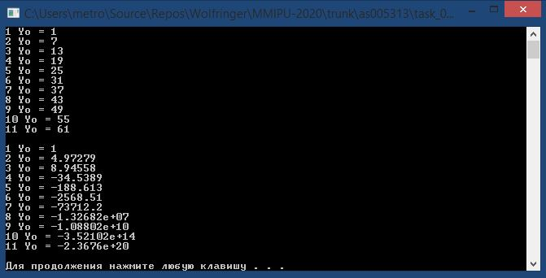

### Кириенко Ю. С.
___
#### Лабораторная работа №1
Реализовать программу (С++), которая симулирует температуру объекта по двум формулам:

##### Код программы:
```c++
#include <iostream>

void line(float a, float b, float y0, float ut, int time) 
{
	std::cout << "1" << " Yo = " << y0 << std::endl;
	for (int i = 0; i < time; i++) 
	{
		y0 = a * y0 + b * ut;
		std::cout << i + 2 << " Yo = " << y0 << std::endl;
	}
	std::cout << std::endl;
}
void n_line(float a, float b, float c, float d, float y0, float ut, float ut1, int time) {
	float Y = y0, y = 0;
	std::cout << "1" << " Yo = " << y0 << std::endl;
	for (int i = 0; i < time; i++) {
		y = y0;
		y0 = a * y0 - b * pow(Y, 2) + c * ut + d * sin(ut1);
		Y = y;
		std::cout << i + 2 << " Yo = " << y0 << std::endl;
	}
	std::cout << std::endl;
}

int main() 
{
	float a = 1;
	float b = 2;
	float c = 3;
	float d = 4;
	float ut = 3;
	float y0 = 1;
	int time = 10;
	float ut1 = 4;
	line(a, b, y0, ut, time);
	n_line(a, b, c, d, y0, ut, ut1, time);
	system("pause");
	return 0;
}
```


