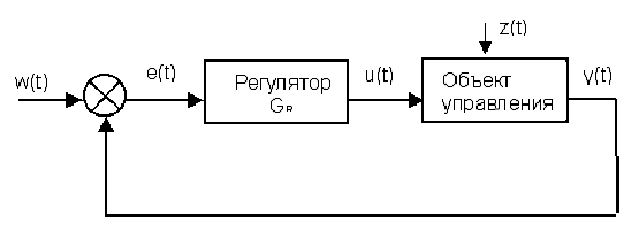
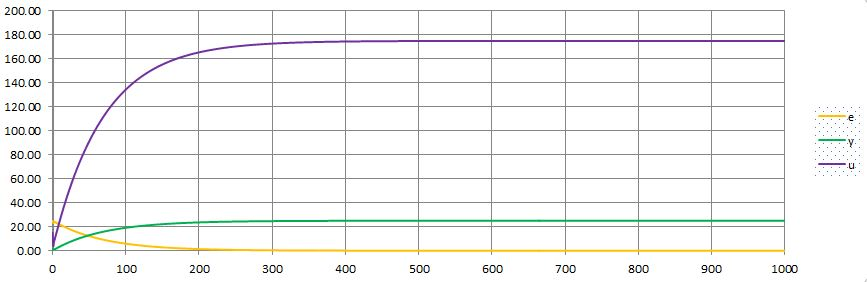
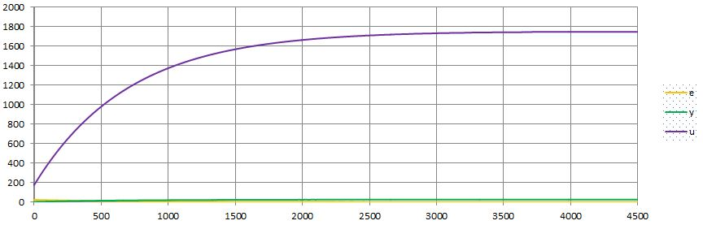

# Кириенко Ю. С.
___
## Лабораторная работа №2
На C++ реализовать программу, моделирующую ПИД-регулятор. 

В качестве объекта управления использовать математическую модель, полученную в предыдущей работе. 
Использовать ООП, в программе должно быть не менее 3-х классов (+наследование).
### Код программы:

#### Source.cpp
```c++
#include <iostream>
#include <cmath>
#include <iomanip>
#include "Mod.h"

int main()
{
	double  a = 0.3, 
		b = 0.0001,  
		b1 = 0.1,
		c = 0.01,  
		d = 0.1,
		u_t = 25,
		y_t = 1, 
		k = 0.1, 
		t = 10,  
		tq = 10,
		td = 50;
	Mod *newMod = new Mod(u_t, y_t, tq);
	Lin *ccol = new Lin(a, b1, c, d, y_t);
	NoLin* cconl = new NoLin(a, b, c, d, y_t);
	Rgl *cr = new Rgl(tq, k, t, td);
	newMod->initmodules(ccol, cconl, cr);
	newMod->active();
	delete newMod;
	return 0;
}
```

#### Mod.h
```c++
#ifndef Mod_H
#define Mod_H
#include <iostream>
#include <fstream>
using std::cout;
using std::endl;
#include <iomanip>

#include "Lin.h"
#include "NoLin.h"
#include "Rgl.h"

class Mod
{
private:
	Lin *col = 0;
	NoLin* con = 0;
	Rgl *cr = 0;
	const double initu, inity, t0;
	double out = 0, et = 0, ut = 0;
public:
	Mod(const double &iu, const double &iy, const double &tq);
	bool initmodules(Lin *&l, NoLin *&n, Rgl *&r);
	double active();
};

#endif
```

#### Mod.cpp
```c++
#include "Mod.h"

Mod::Mod(const double &iu, const double &iy, const double &tq) : initu(iu), inity(iy), t0(tq)
{
	cout << "Mod created";
}

double Mod::active()
{
	std::fstream linout, nlinout;
	linout.open("Lin.csv", std::fstream::out);
	nlinout.open("NoLin.csv", std::ios::out);
	linout.precision(3);
	nlinout.precision(3);
	linout.flags(std::ios::fixed);
	nlinout.flags(std::ios::fixed);

	linout << 'i' << ';' << 'e' << ';' << 'y' << ';' << 'u' << endl;
	for (int i = 0; i < 10000; i++)
	{
		et = initu - out;
		ut = cr->eq(et);
		out = col->eq(ut);
		linout << i << ';' << et <<';' << out << ';' << ut << endl;
	}
	cout << "Lin: \n" << et << ' ' << out << ' ' << ut << endl;

	nlinout << 'i' << ';' << 'e' << ';' << 'y' << ';' << 'u' << endl;
	for (int i = 0; i < 10000; i++)
	{
		et = initu - out;
		ut = cr->eq(et);
		out = con->eq(ut);
		nlinout << i << ';' << et << ';' << out << ';' << ut << endl;
	}
	cout << "Nolin: \n" << et << ' ' << out << ' ' << ut << endl;
	linout.close();
	nlinout.close();
	return true;
}

bool Mod::initmodules(Lin*& l, NoLin*& n, Rgl*& r)
{
	cr = r;
	col = l;
	con = n;
	return true;
}
```

#### Rgl.h
```c++
#pragma once
#ifndef Rgl_H
#define Rgl_H

class Rgl
{
private:
	const double k, t, td, t0;
	double uk = 0, ek1 = 0, ek2 = 0;
	double q0, q1, q2;
public:
	Rgl(const double &qt);
	Rgl(const double &qt, const double &ik);
	Rgl(const double &qt, const double &ik, const double &it);
	Rgl(const double &qt, const double &ik, const double &it, const double &itd);
	double &eq(const double &iek);
};

#endif
```

#### Rgl.cpp
```c++
#include "Rgl.h"

Rgl::Rgl(const double &qt) : Rgl(qt, 0, 0, 0)
{}

Rgl::Rgl(const double &qt, double const& ik) : Rgl(qt, ik, 0, 0)
{}

Rgl::Rgl(const double &qt, const double &ik, const double &it) : Rgl(qt, ik, it, 0)
{}

Rgl::Rgl(const double &qt, const double &ik, const double &it, const double &itd) : t0(qt), k(ik), t(it), td(itd)
{
	q0 = k * (1.0 + td / t0);
	q1 = -k * (1.0 + 2.0*td / t0 - t0 / t);
	q2 = k * td / t0;
}

double &Rgl::eq(const double &iek)
{
	uk += q0 * iek + q1 * ek1 + q2 * ek2;
	ek2 = ek1;
	ek1 = iek;
	return uk;
}
```

#### Lin.h
```c++
#pragma once
#ifndef Lin_H
#define Lin_H
#include "Ctrl.h"

class Lin : protected Ctrl
{
public:
	Lin(const double &ia, const double &ib, const double &ic, const double &id, const double &iy);
	double &eq(const double &iu) override;
};

#endif
```

#### Lin.cpp
```c++
#include "Lin.h"

Lin::Lin(const double &ia, const double &ib, const double &ic, const double &id, const double &iy) : Ctrl(ia, ib, ic, id, iy)
{}

double& Lin::eq(const double &iu)
{
	y = a * y + b * iu;
	return y;
}
```

#### NoLin.h
```c++
#pragma once
#ifndef NoLin_H
#define NoLin_H
#include "Ctrl.h"
#include <cmath>

class NoLin : public Ctrl
{
private:
	double prevu = 0, prevy = 0, ycache = 0;
public:
	NoLin(const double &ia, const double &ib, const double &ic, const double &id, const double &iy);
	double &eq(const double &iu) override;
};

#endif
```

#### NoLin.cpp
```c++
#include "NoLin.h"

NoLin::NoLin(const double &ia, const double &ib, const double &ic, const double &id, const double &iy) : Ctrl(ia, ib, ic, id, iy)
{}

double &NoLin::eq(const double &iu)
{
	ycache = a * y - b * prevy * prevy + c * iu + d * std::sin(prevu);
	prevu = iu;
	prevy = y;
	y = ycache;
	return y;
}
```

#### Ctrl.h
```c++
#pragma once
#ifndef CTRL_H
#define CTRL_H
#include <iostream>

class Ctrl
{
protected:
	double a, b, c, d, y;
public:
	Ctrl(const double& ia, const double& ib, const double& ic, const double& id, const double& iy);
	Ctrl& operator=(const Ctrl*& other);
	Ctrl(Ctrl*& other);
	virtual double &eq(const double &iu) = 0;
};

#endif
```

#### Ctrl.cpp
```c++
#include "Ctrl.h"

Ctrl::Ctrl(const double &ia, const double &ib, const double &ic, const double &id, const double &iy) : a(ia), b(ib), c(ic), d(id), y(iy)
{}

Ctrl::Ctrl(Ctrl*& other) : a(other->a), b(other->b), c(other->c), d(other->d), y(other->y)
{}

Ctrl& Ctrl::operator=(const Ctrl*& other)
{
	this->a = other->a;
	this->b = other->b;
	this->c = other->c;
	this->d = other->d;
	this->y = other->y;
	return *this;
}
```

### Результаты




