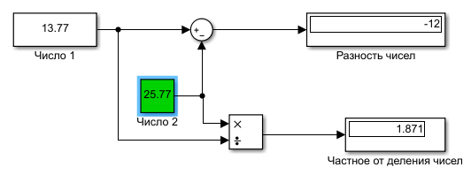
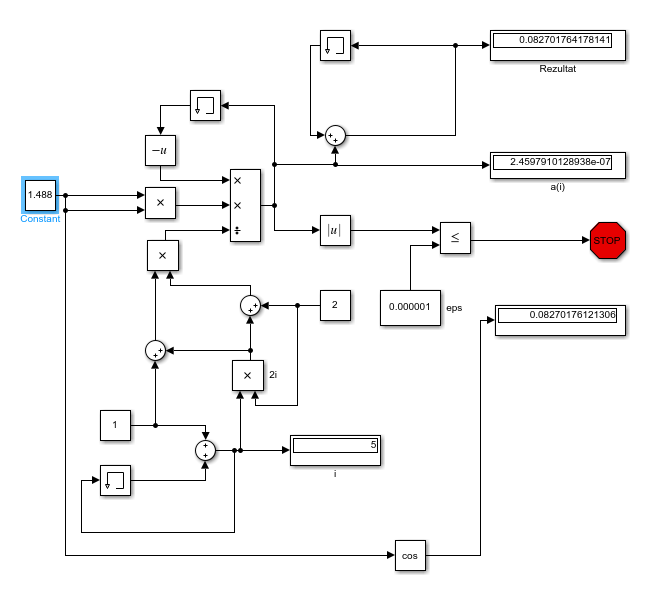

# Laboratory work #1

#### Student: Kovalevich Egor

###### Task 1. Знакомство с Simulink

Model 1:

    

Model 2:

    

Tasks:

    

Блок memory используется для хранения предыдущей переменной для расчета по формуле

    

Display1 отображает последнюю переменную a(i)

Display2 отображает наше количество итераций - i

    

Model 3:

    

