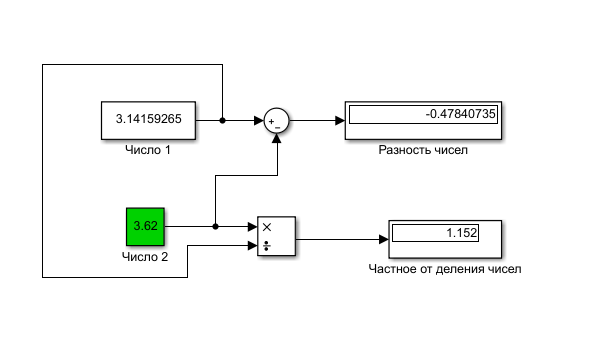
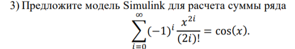

# Laboratory work #1

#### Student: Krivonos Elizaveta

###### Task 1. Introduction to Simulink

example 1:

    

example 2:

    

tasks:

    

Блок memory содержит и задерживает значение предыдущей переменной для расчета по формуле

    

Display1 отображает значение последней переменной a(i)

Display2 отображает наше количество итераций - i

    

    

