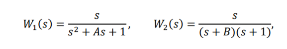
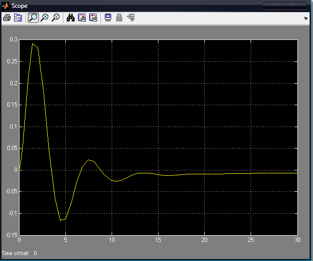
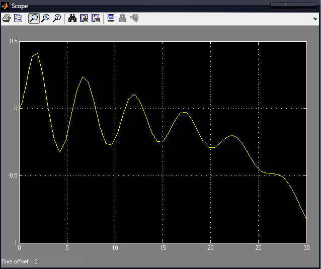
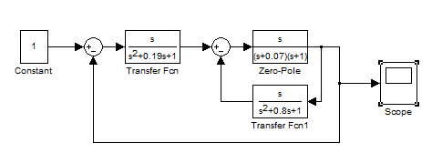
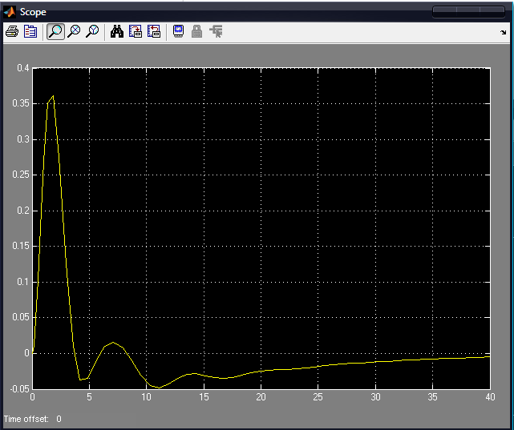

# Laboratory work #2

#### Student: Mazur Igor

###### Task 2. Модель системы с сложной передаточной функцией 

Tasks:

– запустите Matlab и в нем Simulink;

– откройте новое окно модели и постройте модель системы, например,
следующего вида;

    

В используемых передаточной функции (Transfer Fcn) и функции нулиполюса (Zero-Pole) «конструируете» передаточные функции блоков

    

где А = номер дня рождения / 100 = 0.09; В = номер месяца рождения / 100 = 0.06.

Замечание. Можно использовать любую другую структуру.

– на осциллографе (Scope) получите переходную функцию системы. 

Task 1:

    

    

Task 2:

    

    

Task 3:

    

    

