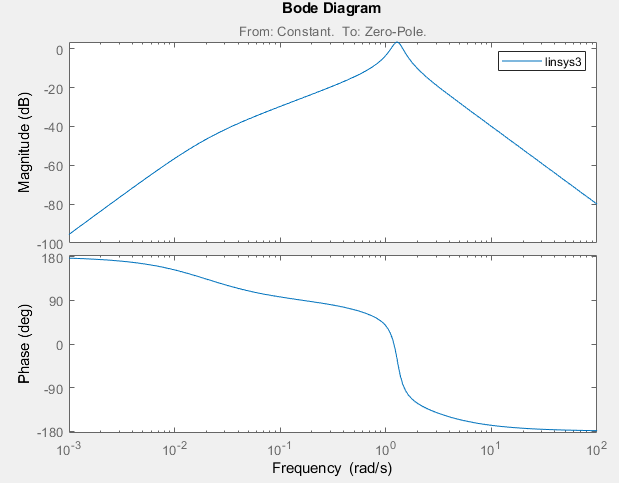
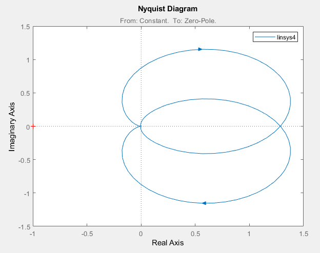

# Laboratory work #3

#### Student: Mazur Igor

###### Lab 3. Модель системы с сложной передаточной функцией 

<b>Tasks:</b>

- Подключить LTI-viewer к вашей системе.

    

- На осциллографе (Scope) получить переходную функцию системы:

    

- <b>Получите основные характеристики системы:</b>
	
1) передаточную функцию

    

	
Вывод: Система устройчива, т.к. функция стремится к 0.

	
2) импульсную характеристику

    

	
3) амплитудно-частотную и фазо-частотные характеристики

    

	
4) диаграмму Найквиста

    

	
Вывод: Система устойчива, т.к. точка (0;-1) не принадлежит области.

	
5) значение нулей и полюсов

    

	
Вывод: Система устройчива – полюса находятся в отрицательной области (2,3 четверти).
