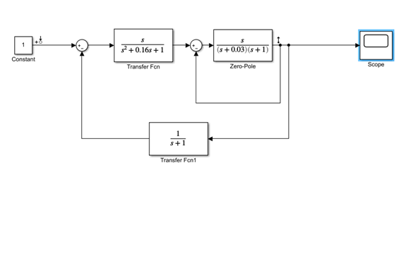
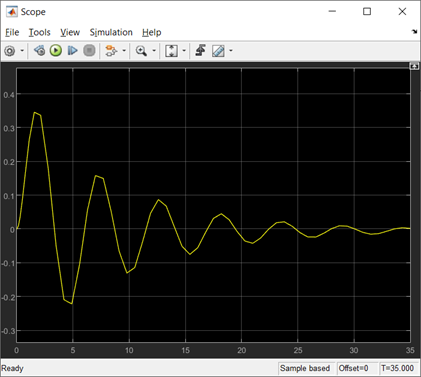
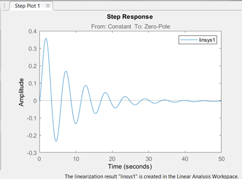
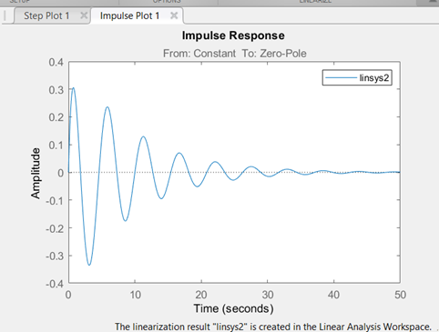
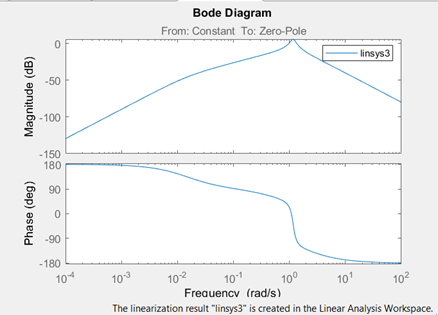
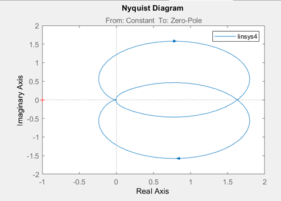
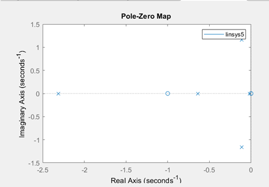

# Laboratory work #3

#### Student: Miskevich Alexandr

###### Task 3. Модель системы с сложной передаточной функцией 

<b>tasks:</b>

- подключить LTI-viewer к вашей системе.

    

- на осциллографе (Scope) получить переходную функцию системы:

    

- получите основные характеристики системы:
1) передаточную функцию

    

Вывод: Система устройчива, т.к. функция стремится к 0.

2) импульсную характеристику

    

3) амплитудно-частотную и фазо-частотные характеристики

    

4) диаграмму Найквиста

    

Вывод: Система устойчива, т.к. точка (0;-1) не принадлежит области.

5) значение нулей и полюсов

    

Вывод: Система устройчива – полюса находятся в отрицательной области (2,3 четверти).