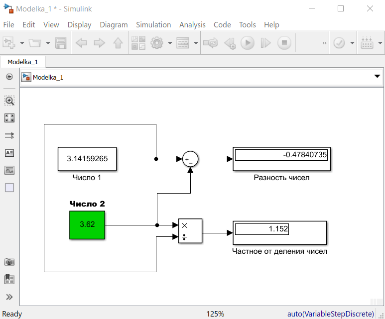
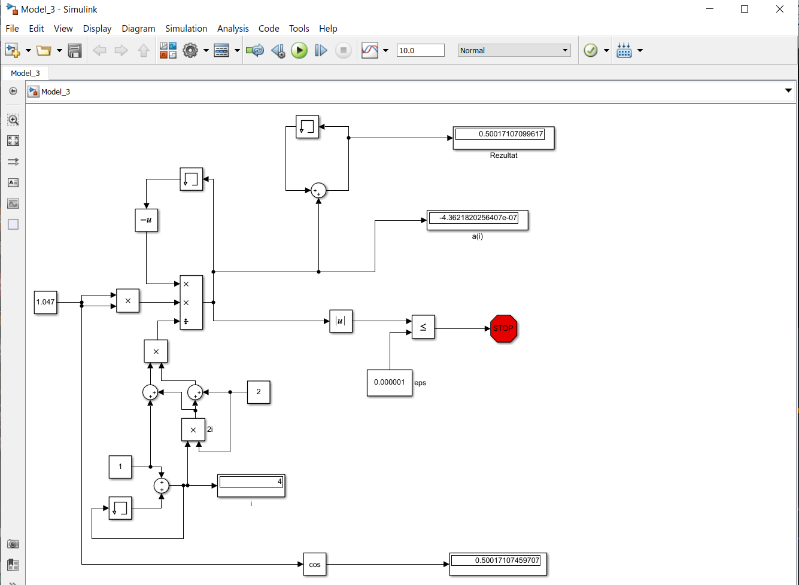

# Laboratory work #1

#### Student: Elena Pstyga

###### Task 1. Acquaintance with Simulink

example 1:

    

example 2:

    

tasks:

    

Блок memory используется для хранения предыдущей переменной для расчета по формуле.

    

Display1 показывает последнюю переменную a(i).

Display2 показывает наше количество итераций - i.

    

    

