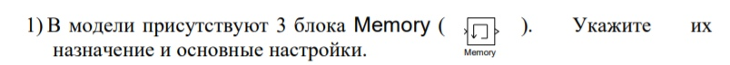
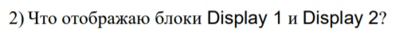
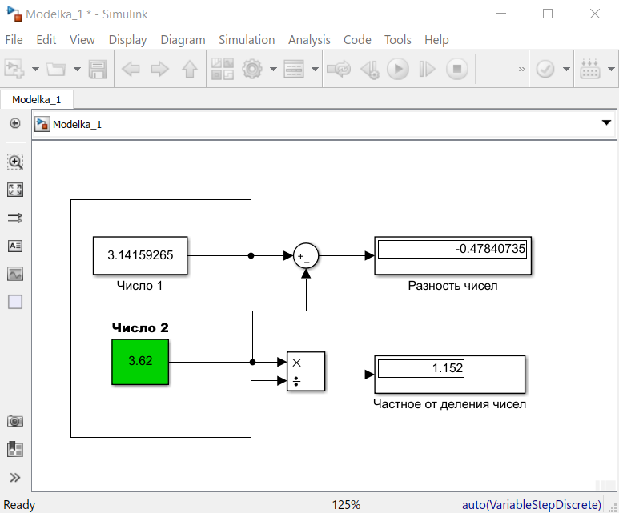
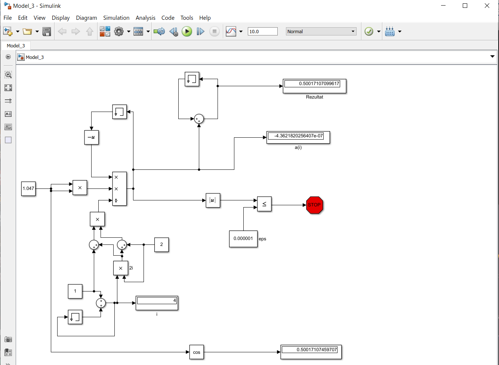
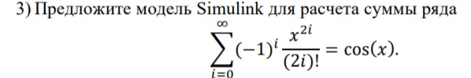

Multi-line comments are here!

You can now comment on multiple lines. Just click and drag on the  button.

Demonstrating selecting multiple lines for commenting

# Laboratory work #1

#### Student: Ratkevich Aleksey

###### Task 1. Знакомство с Simulink

example 1:

    

example 2:

    

tasks:

    

Блок memory используется для хранения предыдущей переменной для расчета по формуле

    

Display1 отображает последнюю переменную a(i)

Display2 отображает наше количество итераций - i

    

    

