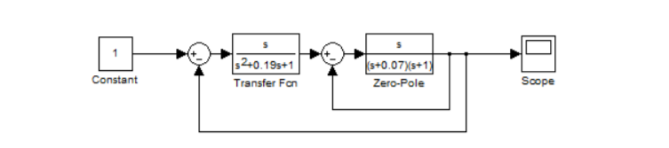
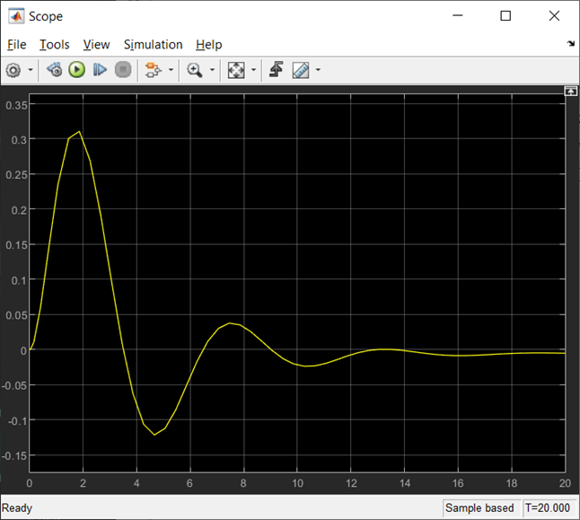
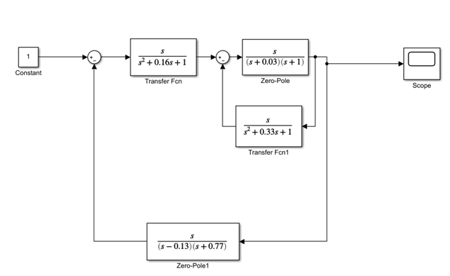
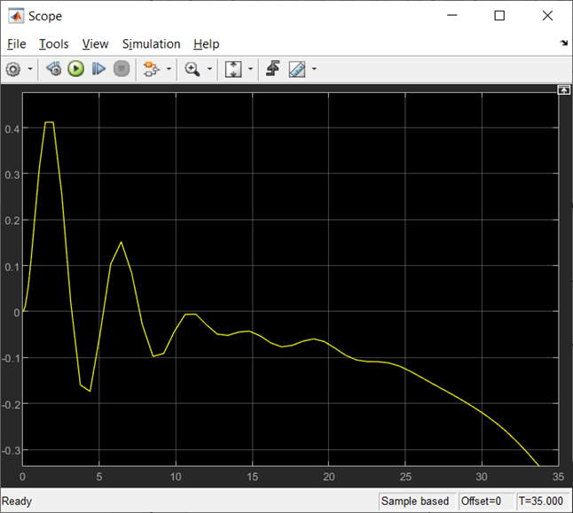
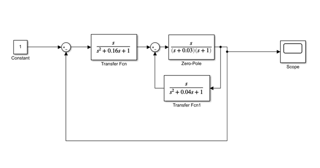
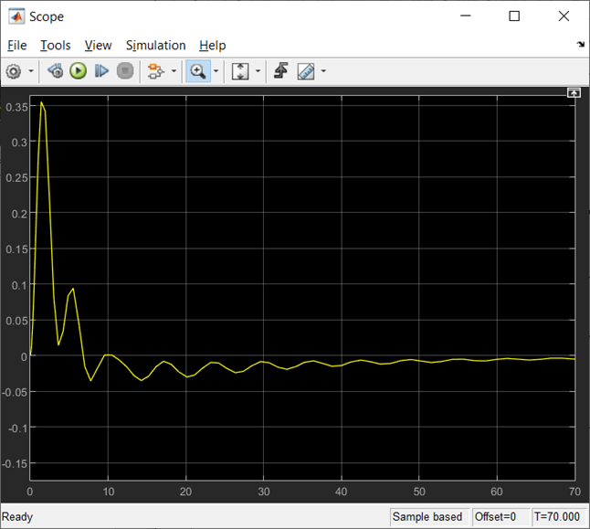

# Laboratory work #2

#### Student: Ratkevich Aleksey

###### Task 2. Модель системы с сложной передаточной функцией 

tasks:

– запустите Matlab и в нем Simulink;

– откройте новое окно модели и постройте модель системы, например,
следующего вида;

    

В используемых передаточной функции (Transfer Fcn) и функции нулиполюса (Zero-Pole) «конструируете» передаточные функции блоков

    

где А = номер дня рождения / 100; В = номер месяца рождения / 100 .
Замечание. Можно использовать любую другую структуру.

– на осциллографе (Scope) получите переходную функцию системы. 

1)

    

    

2)

    

    

3)

    

    

