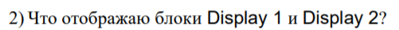

# Laboratory work #1

#### Student: Anatoli Stepanuke

###### Task 1. Acquaintance with Simulink

example 1:

    

example 2:

    

tasks:

    

Блок memory используется для хранения предыдущей переменной для расчета по формуле

    

Display1 показывает последнюю переменную a(i)

Display2 показывает наше количество итераций - i

    

    

