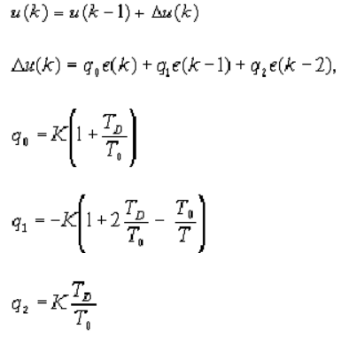
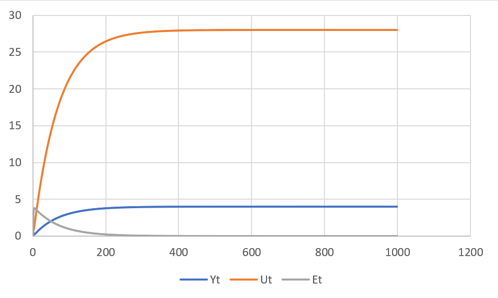
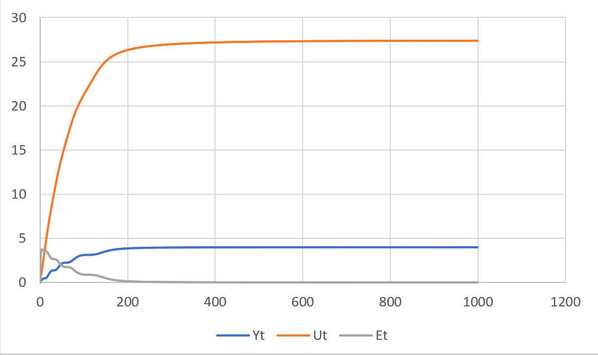
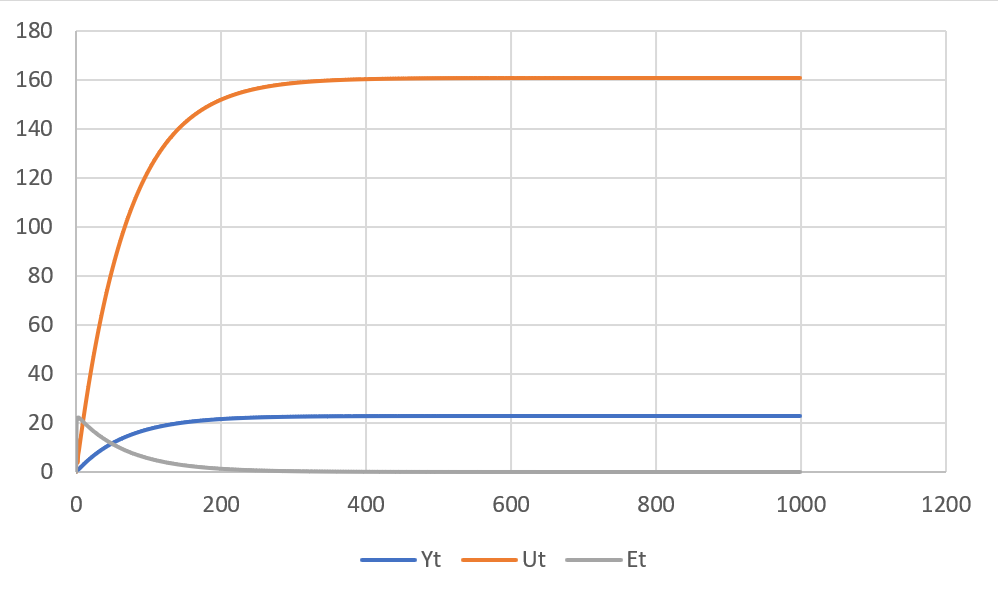
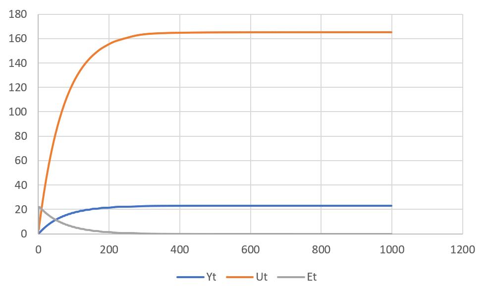

# Laboratory work #2

### Student: Breschuk Dmitri

##### Task 2. Modeling PID Regulator

Write program (C++),

<p align="center">
       


##### Code:

```c++
#include <iostream>
#include <fstream>

using namespace std;

class Model {
public:
	virtual float equation(float ut,float y0) = 0;
};

class Regulator {
private:
	float wt,TD,T0,T,K,ek;
	float uk = 0;
	float ek1 = 0;
	float ek2 = 0;
public:
	Regulator(float wt,float TD,float T0, float T, float K) {
		this->wt = wt;
		this->K = K;
		this->T = T;
		this->T0 = T0;
		this->TD = TD;
	}
	float calculateUt(float yt) {
		float q0 = K * (1.0 + (TD / T0));
		float q1 = -K * (1.0 + (2.0 * TD / T0) - (T0 / T));
		float q2 = K * (TD / T0);
		ek = wt - yt;
		uk += (q0 * ek) + (q1 * ek1) + (q2 * ek2);
		ek2 = ek1;
		ek1 = ek;
		return uk;
	}
};

class LineirFun : public Model {
private:
	float a, b;
public:
	LineirFun(float a, float b) {
		this->a = a;
		this->b = b;
	}
	float equation(float ut,float yt) override {
		  return yt = a * yt + b * ut;
		}
};

class NonLineirFun : public Model {
private:
	float a, b, c, d, y;
	float prevY = 0;
	float ut1 = 0;
public:
	NonLineirFun(float a, float b, float c, float d) {
		this->a = a;
		this->b = b;
		this->c = c;
		this->d = d;
	}
	float equation(float ut, float yt) override {
		y = yt;
		yt = a * y - b * pow(prevY, 2) + c * ut + d * sin(ut1);
		ut1 = ut;
		prevY = y;
		return yt;
	}
};

void PIDRegulator(Model &fun, Regulator &reg,float y0) {
	float yt = y0;
	for (int i = 0; i < 1000; i++) {
		float ut = reg.calculateUt(yt);
		yt = fun.equation(ut,yt);
		cout << "Yt = " << yt << "  Ut = " << ut << endl;
	}
}

int main() {
	float wt = 23;
	float a = 0.3;
	float b = 0.0001;
	float a1 = 0.3;
	float b2 = 0.1;
	float c = 0.1;
	float d = 0.1;
	float T0 = 10;
	float T = 10;
	float TD = 50;
	float K = 0.1;
	float y0 = 1;
	LineirFun *linear = new LineirFun(a1,b2);
	Regulator *reg = new Regulator(wt,TD,T0,T,K);
	NonLineirFun *nonLinear = new NonLineirFun(a, b, c, d);
	Regulator* reg2 = new Regulator(wt,TD,T0,T,K);
	cout << "Linear  \n";
	PIDRegulator(*linear,*reg,y0);
	cout << endl;
	cout << "Non linear \n";
	PIDRegulator(*nonLinear,*reg2,y0);
	return 0;
}
```
### Graphics:

1) Linear graph with wt = 4

<p align="center">
       

2) NonLinear graph with wt = 4

<p align="center">
       

3) Linear graph with wt = 23

<p align="center">
       
4) NonLinear graph with wt = 23

<p align="center">
       
