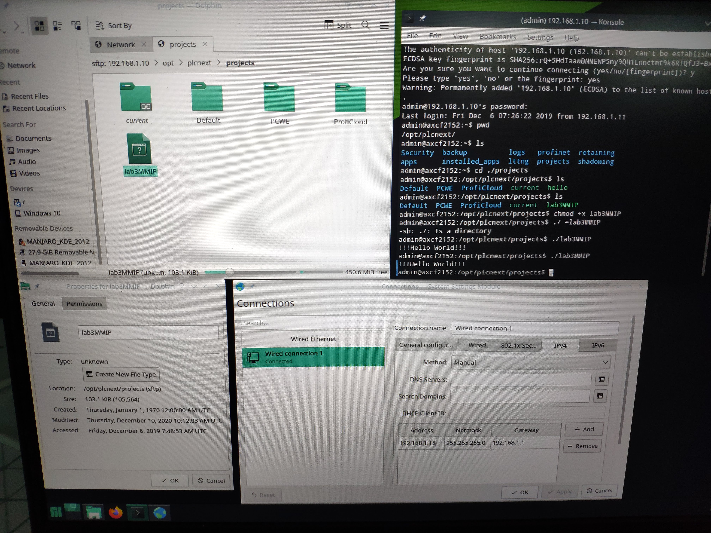
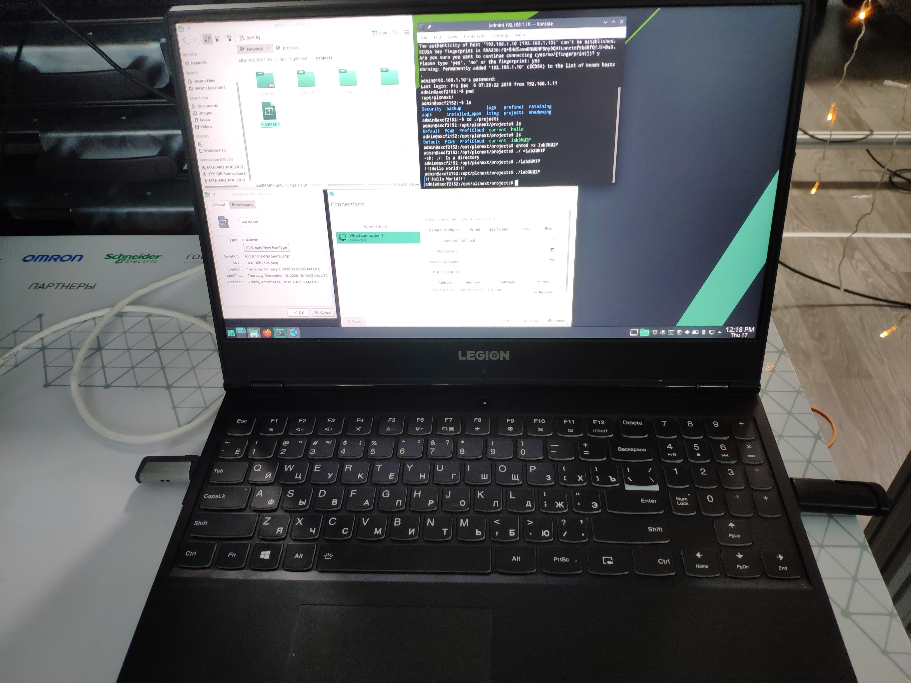

# Laboratory work #3

### Student: Breschuk Dmitri

##### Task 3. Work with AXC F 2152 controller

##### Configure Eclipse® to program and crosscompile for the AXC F 2152

Problems which I was faced:

1: I have a notebook without RJ45 port "Xiaomi notebook air 13" because of it I had to use friend's notebook.(I couldn't find a usb to RJ45 in the laboratory which I needed)(They gave me a "The TCSMCNAM3M002P is an USB/RJ45 Connection Cable for connection between PC and drive. It is compatible with Altivar 12, Altivar 312 Solar, Lexium 32i, Lexium ILA, ILE, ILS, Acti 9 Smartlink, Lexium 28 and SoMove range." which can't work such a lan network  )

2: I installed Ubuntu on my notebook and built a project using Eclipse(2019.9R)

3:I run an Manjaro installer on my friend's notebook and configured it for work with AXC F 2152

4: After it I transferred my output file to controller and execute it 

### Screenshots:

<p align="center">
       

<p align="center">
       

### Video:

```none
[](https://youtu.be/ciMyl-Rdti0)
```

### Code:

```c++
//============================================================================
// Name        : lab3MMIP.cpp
// Author      : dima
// Version     :
// Copyright   : Your copyright notice
// Description : Hello World in C++, Ansi-style
//============================================================================

#include <iostream>
using namespace std;

int main() {
	cout << "!!!Hello World!!!" << endl; // prints !!!Hello World!!!
	return 0;
}
```

