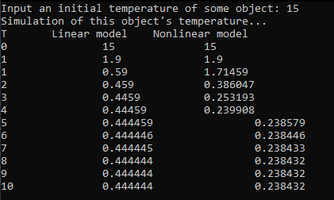

## Laboratory work #1
### Alina Grigoruk, AS-54f
**Aim:** To create C++ program that simulates some object's temperature.<br>
**Code:**<br>
 ```c++
  #include <iostream>
  #include <cmath>
  using namespace std;

  int main() {
    int t = 10;
    double a = 0.1, b = 0.2, c = 0.3, d = 0.4;
    double y0 = 20;
    double y1, y2, y22;
    double ut = 2, utt = 1;

    cout << "Input an initial temperature of some object: ";
    cin >> y1; y2 = y1;     
    cout << "Simulation of this object's temperature...\n";

    cout << "T\tLinear model\tNonlinear model\n";
    cout << 0 << "\t\t" << y1 << "\t\t" << y2 << "\n";
    y1 = a * y1 + b * ut;
    y22 = y1;
    cout << 1 << "\t\t" << y1 << "\t\t" << y22 << "\n";

    for (int i = 1; i <= t; i++) {
      y1 = a * y1 + b * ut;
      y2 = a * y2 - b * pow(y22, 2) + c * ut + d * sin(utt);
      cout << i << "\t\t" << y1 << "\t\t" << y2 << "\n";
    }
    return 0;
  }
```      
**Result:**<br>


**Conclusion:** During this laboratory work I have created C++ program that simulates temperature of some object.
