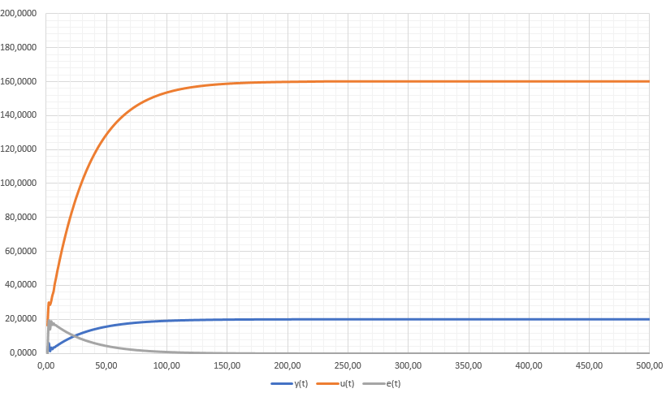
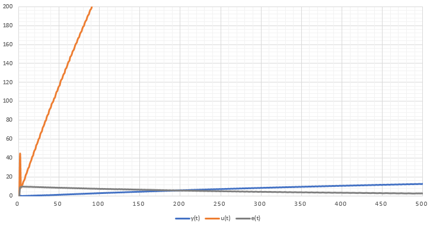

## Laboratory work #1
### Alina Grigoruk, AS-54f
**Aim:** To create C++ program that simulates work of PID regulator.<br>
**Code:**<br>
```c++
#include <iostream>
#include<math.h>

using namespace std;

/*!
	\brief template for constructing object of control

	abstract class that will be used to construct linear and non-linear models
*/
class Model
{
public:
	/*!
	abstract function to be overridden	
	\param inpWarm input warm
	\param y output value
	*/
	virtual float equation(double inpWarm, double y) = 0;
};

/*!
	\brief class that represents linear model of controlled object

	extends class Model hence it's a child class that represents linear model 
*/
class LinearModel : public Model {
private:
	float a, b;

public:
	/*!
		constructor for linear model class
		\param a,b coefficients
	*/
	LinearModel(const float a, const float b) {this->a = a; this->b = b;}
	/*!
		function that calculates y
		\param inpWarm input warm calculated by regulator
		\param y initial value of y
		\return y new value of y
	*/
	float equation(double inpWarm, double y) override {
		y = a * y + b * inpWarm;
		return y;
	}
};

/*!
	\brief class that represents non-linear model of controlled object

	extends class Model hence it's a child class that represents non-linear model
*/
class NonLinearModel : public Model {
private:
	float a, b, c, d;
	double y0 = 0, inpWarm0 = 0;

public:
	/*!
		constructor for non-linear model class
		\param a,b,c,d coefficients
	*/
	NonLinearModel(float a, float b, float c, float d) {this->a = a; this->b = b; this->c = c; this->d = d;}
	/*!
		function that calculates y
		\param inpWarm input warm calculated by regulator
		\param y initial value of y
		\return y1 new value of y
	*/
	float equation(double inpWarm, double y) override {
		double y1 = a * y - b * pow(y0, 2) + c * inpWarm + d * sin(inpWarm0);
		y0 = y;
		inpWarm0 = inpWarm;
		return y1;
	}
};

/*!
	\brief class for regulator implementation

	Regulator class that will calculate input warm 
*/
class Regulator {
private:
	double inpWarm = 0;
	double K, T, TD, T0;

public:
	/*!
		constructor for regulator class
		\param K,T0,TD,T coefficients
	*/
	Regulator(const double K, const double T0, const double TD, const double T) {this->K = K; this->T0 = T0; this->TD = TD; this->T = T;}
	/*!
		function that calculates input warm
		\param e,e0,e00 current, previous, and previous of previous one errors
		\return inpWarm calculated value of input warm
	*/
	double InpWarm(const double e, const double e0 = 0, const double e00 = 0) {
		double q0 = K * (1.0 + TD / T0);
		double q1 = -K * (1 + 2.0 * TD / T0 - T0 / T);
		double q2 = K * TD / T0;
		inpWarm += q0 * e + q1 * e0 + q2 * e00;
		return inpWarm;
	}
};

/*!
	\brief function for PID regulator implementation

	Simulates the work of PID regulator
	\param w some value
	\param y initial value of y
	\param reg some regulator
	\param m some model
*/
void PIDRegulator(const double w, double y, Regulator* reg, Model* m) {
	double e = 0.0, e0 = 0.0, e00 = 0.0;
	double u = 0;
	for (int k = 0; k < 500; k++) {
		cout << e << "\t\t" << y << "\t\t" << u << endl;
		e = w - y;
		u = reg->InpWarm(e, e0, e00);
		y = m->equation(u, y);
		e00 = e0;
		e0 = e;
	}
}

/*!
	\brief main function that controls all process of PID regulator simulation
*/
int main()
{
	cout << "Linear model:\nE\t\tY\t\tU\n";
	LinearModel* m = new LinearModel(0.2, 0.1);
	Regulator* r = new Regulator(0.5, 5.0, 25.0, 10.0);
	PIDRegulator(20, 1, r, m);

	cout << "\n\nNonlinear model:\nE\t\tY\t\tU\n";

	NonLinearModel* nlm = new NonLinearModel(0.1, 0.0001, 0.01, 0.1);
	Regulator* nlr = new Regulator(0.5, 5.0, 45.0, 10.0); 
	PIDRegulator(10, 1, nlr, nlm);

	return 0;
}
```
**Result:**<br>
**Linear model**<br>
<br>
**Non-linear model**<br>
<br>

**Conclusion:** During this laboratory work I have created C++ program that simulates PID regulator's work.
