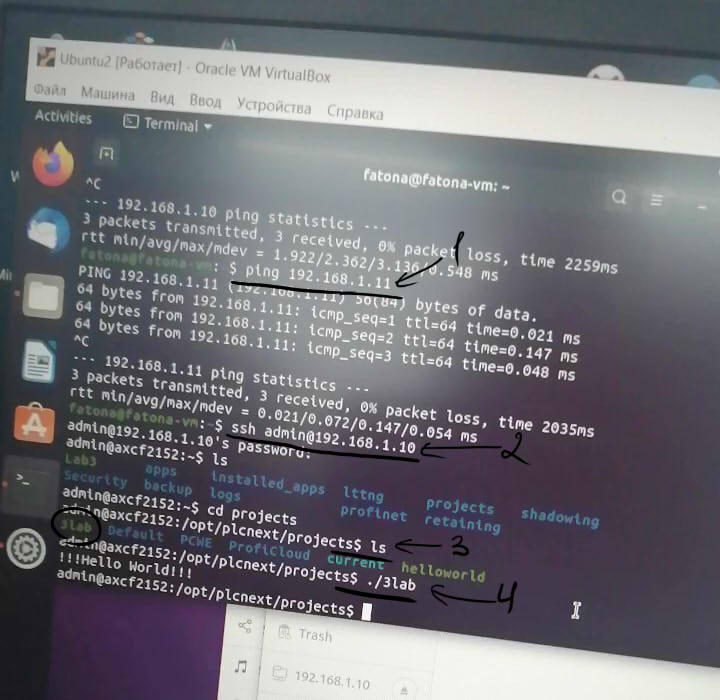

## Laboratory work #3
### Alina Grigoruk, AS-54f
**Aim:** To create test project "Hello world!" and run it on the test controller (AXC F 2152).<br>
**On the [video](https://youtu.be/JIINDsvHPgg) you can see controller connected via Ethernet cable to my laptop. Also there is the result of running "Hello world!" program on controller**<br>
### Procedure
1. Check connection<br>
2. Connect with controller<br>
3. Check if file with code actually copied to controller<br>
4. Run the code<br>
<br>

```c++
#include <iostream>
using namespace std;
int main() {
	cout << "!!!Hello World!!!" << endl;
	return 0;
}
```
**Conclusion:** During this laboratory work I have created "Hello world!" project and run it on AXC F 2152 controller.
