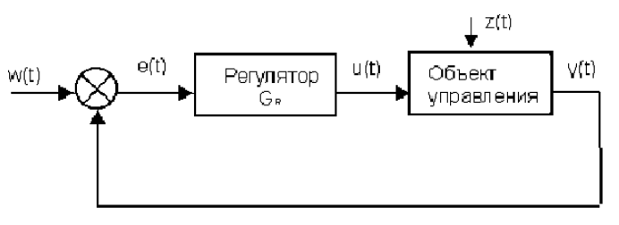
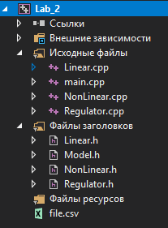
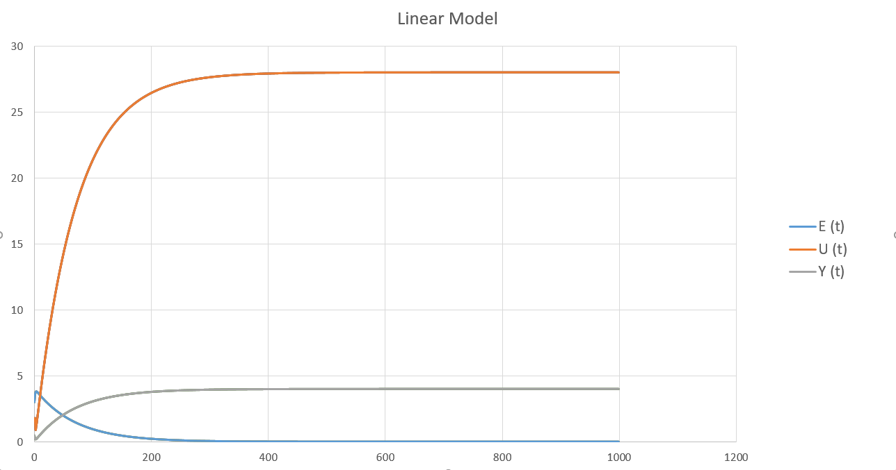
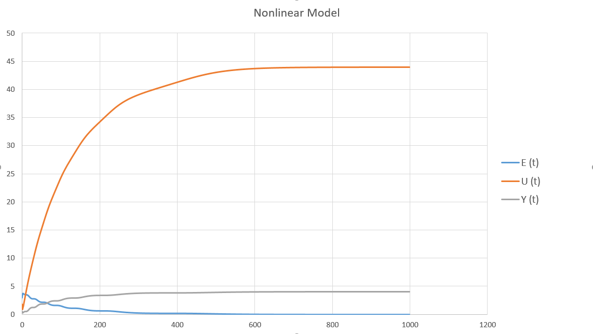

# Laboratory work #2

### Student: Dobrolinskiy Ilya
##### Task 2. PID controller

Write program (C++), that models PID - controller.

PID - controller:

<p align="center">
    
</p>


## Project:
<p>
    
</p>


### main.cpp :
```c++
#include<iostream>
#include<math.h>
#include "Regulator.h"
#include "NonLinear.h"
#include "Linear.h"
#include <fstream>
using namespace std;

int main() {
	float w_t = 4;
	float a = 0.3, b = 0.1;
	float a1 = 0.3, b1 = 0.1, c1 = 0.1, d1 = 0.1;
	float K = 0.1, T0 = 10, TD = 50, T = 10;
	float y0 = 1;

	
	Linear *model = new Linear(a, b, y0);//(a, b, y0)
	Regulator* regulator = new Regulator(K, T0, TD, T);//(K, T0, TD, T)
	regulator->PIDRegulator(w_t, regulator, model, y0);//(w_t, regulator, model, y0)

	cout << "\n\n\n\n";

	NonLinear* nl_model = new NonLinear(a1, b1, c1, d1, y0);//(a1, b2, c, d, y0)
	Regulator* nl_regulator = new Regulator(K, T0, TD, T);//(K, T0, TD, T)
	nl_regulator->PIDRegulator(w_t, nl_regulator, nl_model, y0);//(w_t, nl_regulator, nl_model, y0)

	return 0;
}
```

### Regulator.cpp :
```c++
#include "Regulator.h"
#include <fstream>
using namespace std;

Regulator::Regulator(const double K, const double T0, const double TD, const double T)
{
	this->K = K;
	this->T0 = T0;
	this->TD = TD;
	this->T = T;
}

double Regulator::get_Ut(const double E, const double E0, const double E0prev)
{
	double q0 = K * (1.0 + TD / T0);
	double q1 = -K * (1 + 2.0 * TD / T0 - T0 / T);
	double q2 = K * TD / T0;
	U += q0 * E + q1 * E0 + q2 * E0prev;
	return U;
}

void Regulator::PIDRegulator(const double w, Regulator * reg, Model * lm, double Yinit)
{
	double E = 0.0, Eprev = 0.0, Eprevprev = 0.0;
	double u = 0, y = Yinit;

	fstream file;
	file.open("file.csv", ios::out | ios::app | ios::in);
	file << "¹,E,U,Y" << endl;

	for (int k = 0; k < 1000; k++) {
		E = w - y;
		u = reg->get_Ut(E, Eprev, Eprevprev);
		y = lm->equation(u);

		file << k << "," << E << "," << U << "," << y << "\n";

		Eprevprev = Eprev;
		Eprev = E;
	}
	file << "\n\n\n\n\n";
	file.close();
}
```


###  Linear.cpp :
```c++
#include "Linear.h"

Linear::Linear(const float a, const float b, const double Y)
{
	this->a = a;
	this->b = b;
	this->Y = Y;
}

float Linear::equation(double U)
{
	Y = a * Y + b * U;
	return Y;
}
```


###  NonLinear.cpp :
```c++
#include "NonLinear.h"
#include "Math.h"

NonLinear::NonLinear(const float a, const float b, const float c, const float d, const float Y)
{
	this->a = a;
	this->b = b;
	this->c = c;
	this->d = d;
	this->Y = Y;
}

float NonLinear::equation(double U)
{
	Yafter = a * Y - b * pow(Ybefore, 2) + c * U + d * sin(U_prev);
	Ybefore = Y;
	Y = Yafter;
	U_prev = U;
	return Yafter;
}
```


###  Regulator.h :
```c++
#pragma once
#include"Model.h"

class Regulator
{
private:
	double U = 0;
	double K, T0, TD, T;
public:
	Regulator(const double K, const double T0, const double TD, const double T);
	double get_Ut(const double E, const double E0 = 0, const double E0prev = 0);
	void PIDRegulator(const double w, Regulator *reg, Model *lm, double Yinit);
};
```


###  Linear.h :
```c++
#pragma once
#include"Model.h"

class Linear : public Model
{
private:
	float a, b;
	double Y = 0;
public:
	Linear(const float a, const float b, const double Y);
	float equation(double U) override;
};
```


### NonLinear.h :
```c++
#pragma once
#include"Model.h"

class NonLinear : public Model
{
private:
	float a, b, c, d;
	double Y = 1;
	double Ybefore = 0;
	double Yafter = 0;
	double U_prev = 0;

public:
	NonLinear(const float a, const float b, const float c, const float d, const float Y);
	float equation(double U) override;
};
```


### Model.h :
```c++
#pragma once

class Model
{
public:
	virtual float equation(double InputWarm) = 0;
};
```

##### Result:
```w(t) = 4 K = 0.1 T0 = 10 TD = 50 T = 10```

##### Linear
 ```a = 0.3 b = 0.1```
<p align="center">
    
</p>

##### Nonlinear
```a = 0.3 b = 0.1 c = 0.1 d = 0.1```
<p align="center">
    
</p>