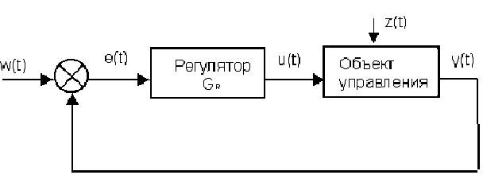
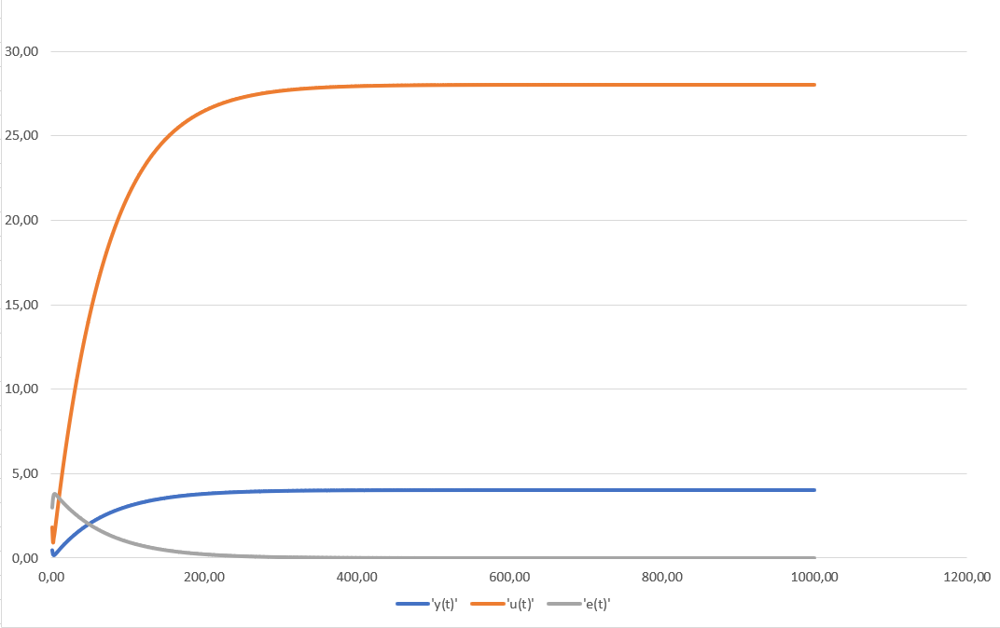
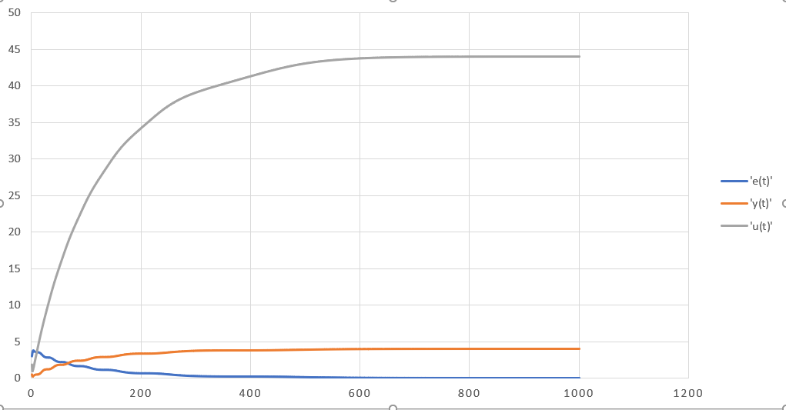
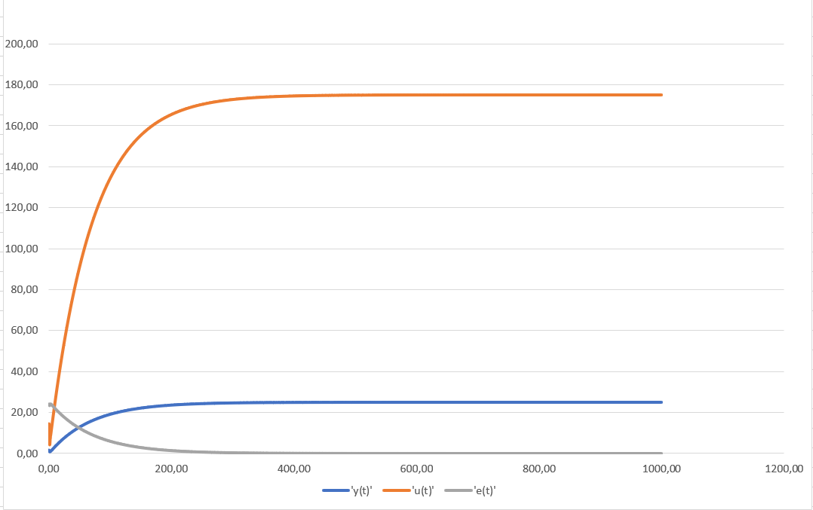
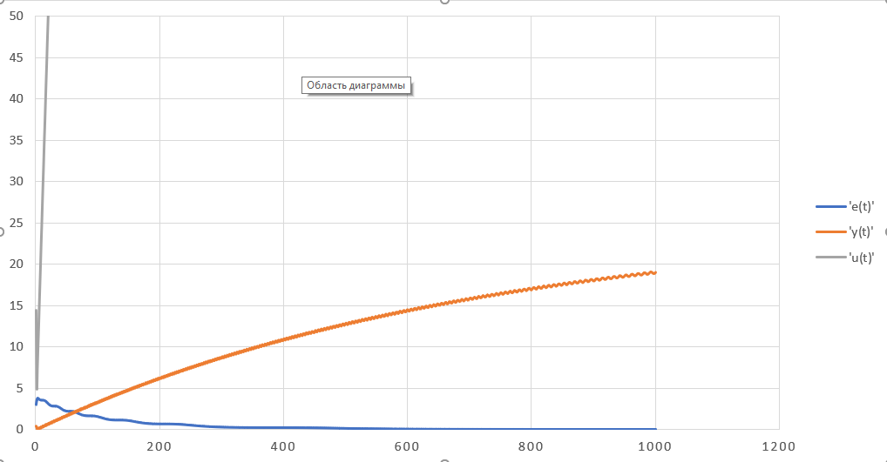

# Laboratory work #2

### Student: Isachenka Anton
##### Task 2. PID controller

Write program (C++), that models PID - controller.

PID - controller:

<p align="center">
    
</p>


##### Code:

```c++
#include<iostream>
#include<math.h>
#include<fstream>

using namespace std;


class Model
{
public:
	virtual float equation(double InputWarm) = 0;
};


class LinearModel : public Model {
private:
	float a, b;
	double Y = 0;
public:
	LinearModel(const float a, const float b, const double Y) {
		this->a = a;
		this->b = b;
		this->Y = Y;
	}
	float equation(double InputWarm) override {
		//cout << " " << Y;
		Y = a * Y + b * InputWarm;
		return Y;
	}
};


class NonLinearModel : public Model {
private:
	float a, b, c, d;
	double Y = 1;
	double Yprev = 0;
	double Ynext = 0;
	double InputWarmPrev = 0;
public:
	NonLinearModel(const float a, const float b, const float c, const float d, const float Y) {
		this->a = a;
		this->b = b;
		this->c = c;
		this->d = d;
		this->Y = Y;
	}
	float equation(double InputWarm) override {
		//cout << "Y= " << Y; todo: Ошибка в вычислении
		//cout << InputWarm << " " << InputWarmPrev << endl;
		//cout<<Ynext << " " << Y << " " << Yprev << endl;
		Ynext = a * Y - b * pow(Yprev, 2) + c * InputWarm + d * sin(InputWarmPrev);

		Yprev = Y;
		Y = Ynext;
		InputWarmPrev = InputWarm;

		return Ynext;
	}

};


class Regulator {
private:
	double InputWarm = 0;
	double K, T0, TD, T;
public:
	Regulator(const double K, const double T0, const double TD, const double T) {
		this->K = K;
		this->T0 = T0;
		this->TD = TD;
		this->T = T;
	}
	double getImputWarm(const double E, const double Eprev = 0, const double Eprevprev = 0) {
		double q0 = K * (1.0 + TD / T0);
		double q1 = -K * (1 + 2.0 * TD / T0 - T0 / T);
		double q2 = K * TD / T0;
		InputWarm += q0 * E + q1 * Eprev + q2 * Eprevprev;
		//cout <<" "<< InputWarm<<" ";
		return InputWarm;
	}

};


void PIDRegulator(const double w,Regulator *reg, Model *lm,double Yinit) {
	double E = 0.0, Eprev = 0.0, Eprevprev = 0.0;
	double u = 0, y = Yinit;
	//ofstream foutE("E.txt");
	//ofstream foutU("U.txt");
	//ofstream foutY("Y.txt");
	for (int k = 0; k < 10000; k++) {
		E = w - y;
		u = reg->getImputWarm(E, Eprev, Eprevprev);
		y = lm->equation(u);
		
		//cout << E << " " << y << " " << u << endl;
		//foutE << E << endl;
		//foutU << u << endl;
		//foutY << y << endl;


		Eprevprev = Eprev;
		Eprev = E;
	}
	//foutE.close();
	//foutU.close();
	//foutY.close();
}


int main() {
	LinearModel *m = new LinearModel(0.3, 0.1, 1);
	Regulator* r = new Regulator(0.1, 10, 50, 10);
	PIDRegulator(25, r, m, 1);

	cout << "\n\n\n\n";

	NonLinearModel* nlm = new NonLinearModel(0.3, 0.0001, 0.01, 0.1, 1);
	Regulator* nlr = new Regulator(0.1, 10, 50, 10);

	PIDRegulator(25, nlr, nlm, 1);
	return 0;
}

```

##### Result:
```w(t) = 4```
##### Linear
<p align="center">
    
</p>

##### Nonlinear
<p align="center">
    
</p>

```w(t) = 25```
##### Linear
<p align="center">
    
</p>

##### Nonlinear
<p align="center">
    
</p>