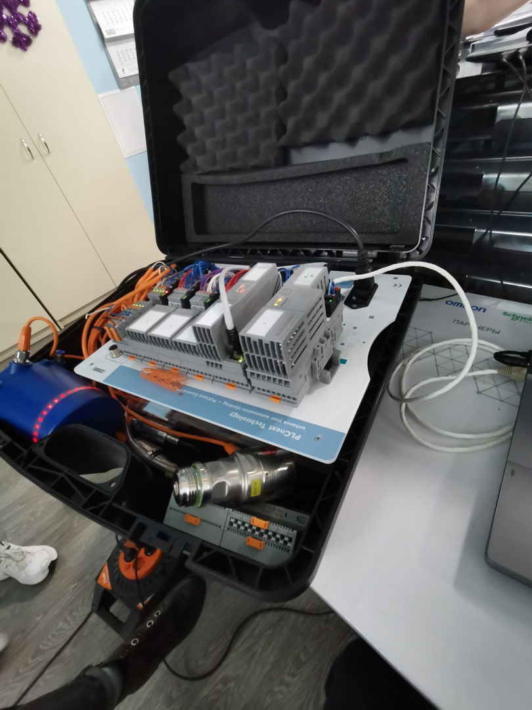
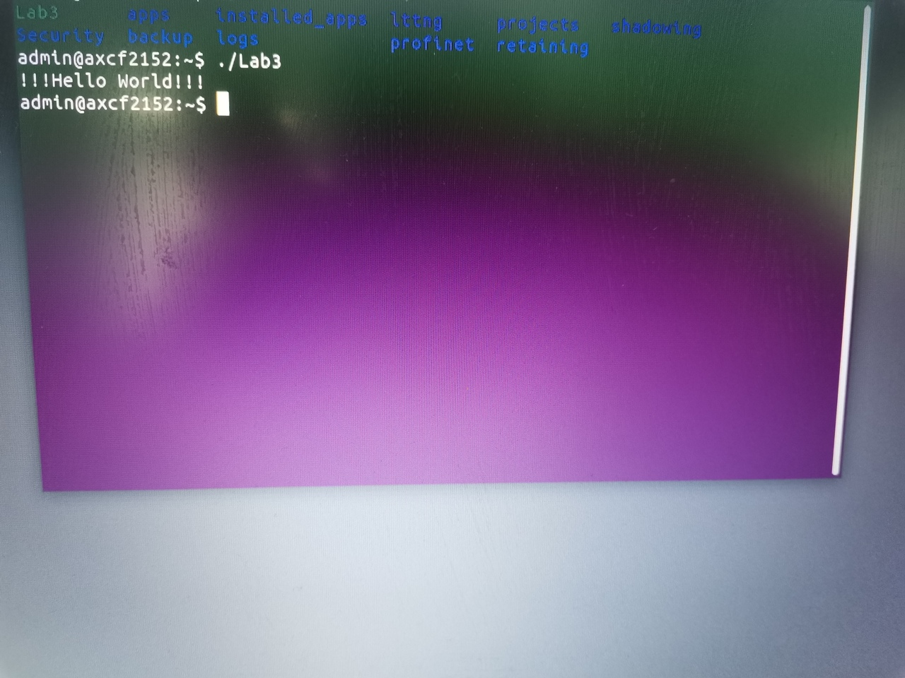
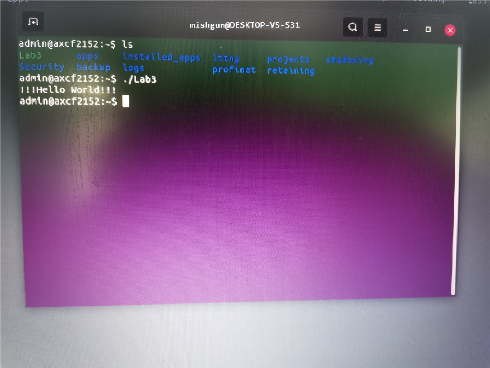

# Laboratory work No3
## Work with controller AXC F 2152
### Completed by Klimashevich Michail
## Task: Study the tutorial and prepare an Ubuntu 18.04 LTS image according to it. 
##General information about the AXC F 2152 controller can be found here.
##In the Eclipse environment, create a "Hello world!" Test project, build it,
##and demonstrate it works on a test controller.

##### Solution:
 
###### The code:
```c
#include <iostream>
using namespace std;
int main() {
	cout << "!!!Hello World!!!" << endl; 
	return 0;
}
```
 
##### Results






