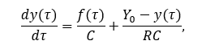
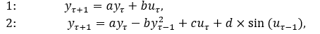

# Laboratory work No1
## Modelling control object
### Completed by Kozik Ilya
### Task: write program (C++), which simulate object temperature.
### Given:
##### Lets get some object to be controlled. We want to control its temperature, which can be described by this differential equation:

##### where τ – time (discrete moments 1,2,3…n); y_τ – input temperature; f_τ – input warm; Y_0 – room temperature; C,RC – some constants.



 ##### Coresponding linear and nonlinear models:



 ##### Task is to write program (C++), which simulates this object temperature.
 ##### Solution:
 
 The code:
```cpp
#include <iostream>
#include <math.h>
#include <iomanip>
using namespace std;


void linear(float y_t, float u_t, int a, float b);
void nonLinear(float y_t, float u_t, int a, float b, int c, int d);


int main()
{
	int a = 1, c = 2, d = 3;
	float y_t = 5, u_t = 8, b = 0.0005;
	linear(y_t, u_t, a, b);
	nonLinear(y_t, u_t, a, b, c, d);
	return 0;
}

void linear(float y_t, float u_t, int a, float b)
{
	float y_t1 = 0;
	cout << "By linear equation: \n>>>>>\t\t\t\t<<<<<" << endl;
	cout << "y(t)\t\t\t\ty(t+1)" << endl;
	for (int i = 0; i < 10; i++) {
		y_t1 = a * y_t + b * u_t;
		cout << "No:" << i + 1 << "\t" << setprecision(4) << y_t << "\t\t\t" << y_t1 << endl;
		y_t = y_t1;
	}
}

void nonLinear(float y_t, float u_t, int a, float b, int c, int d)
{
	float y_t0 = 0, y_t1;
	cout << "By non-linear equation: \n>>>>>\t\t\t\t<<<<<" << endl;
	cout << "y(t)\t\t\t\ty(t+1)" << endl;
	for (int i = 0; i < 10; i++) {
		y_t1 = a * y_t - b * pow(y_t0, 2) + c * u_t + d * sin(u_t);
		cout <<"No:"<<i+1<<"\t"<< setprecision(4) << y_t << "\t\t\t" << y_t1 << endl;
		y_t0 = y_t;
		y_t = y_t1;
	}
}

##### Solution: 

```
By linear equation:

|No:    |     y(t)      |   y(t+1)   |
| -----------: | :----------: | ----------: |
|1      |5                     |5.004
|2      |5.004                 |5.008
|3      |5.008                 |5.012
|4      |5.012                 |5.016
|5      |5.016                 |5.02
|6      |5.02                  |5.024
|7      |5.024                 |5.028
|8      |5.028                 |5.032
|9      |5.032                 |5.036
|10     |5.036                 |5.04

By non-linear equation:

|No:     |  y(t)  |   y(t+1)   |
| ----------- | :----------: | -----------: |
|1    	 |5                       |23.97
|2     	 |23.97                   |42.92
|3    	 |42.92                   |61.6
|4     	 |61.6                    |79.65
|5       |79.65                   |96.72
|6       |96.72                   |112.5
|7       |112.5                   |126.8
|8       |126.8                   |139.4
|9       |139.4                   |150.4
|10      |150.4                   |159.6
