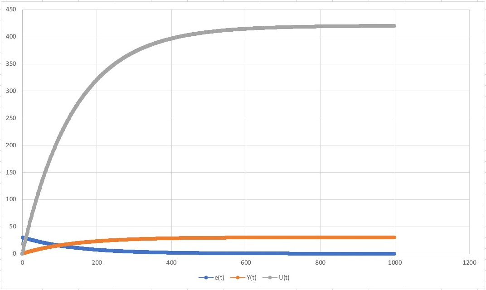
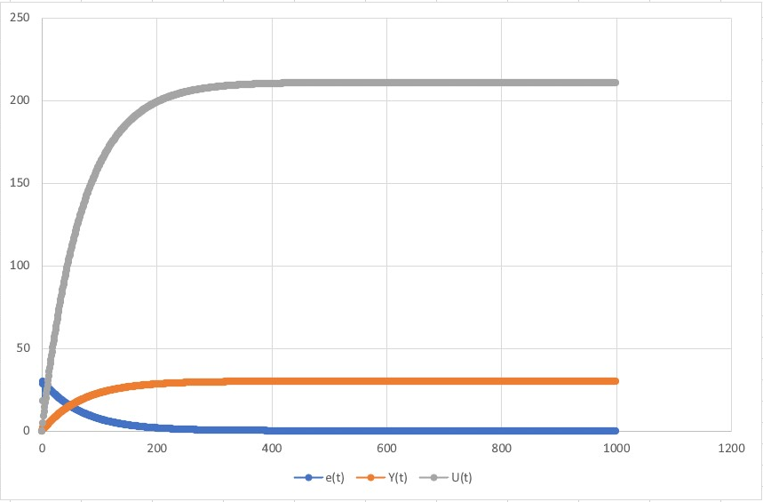

# Laboratory work No2
## PID regulators
### Completed by Kozik Ilya
### Task: Create program on c++ that will sumulate PID regulator. Use OOP. Model should be taked from the previous work
### PID regulator


 ##### Solution:
 
 ###### The code:
 ###### File Source.cpp:
 ```  
 /**libraries definitions
There are some libraries
that were used in that project
*/
#include <iostream>
#include <math.h>
#include "Linear.h"
#include "Model.h"
#include "Non_linear.h"
#include "Reg.h"

using std::cout;

/**In main() function we calculate
both linear and non-linear equations
for PID-regulator
*/
int main()
{
	
	Regulate* regulator = new Regulate;
	Lin* linear = new Lin;
	regulator->start_PID(25, linear, 0);

	cout << "\n\n";

	Regulate* regulator2 = new Regulate;
	Non_lin* non_linear = new Non_lin;
	regulator2->start_PID(25, non_linear, 0);

	return 0;
} 
``` 

###### File Linear.cpp:
```
#include "Linear.h"
#include "Model.h"

///Lin class method

float Lin::calc(float u_t, float y_t) {
	return a * y_t + b * u_t;
}
```
###### File Linear.h:
```
#pragma once
#include "Model.h"
///Class for linear solving
class  Lin : public Model{
public:
	float a = 0.3, b = 0.05;
	float calc(float u_t, float y_t);
};
```
###### File Non_linear.cpp:
``` 
#pragma once
#include "Model.h"
///Class for linear solving
class  Lin : public Model{
public:
	float a = 0.3, b = 0.05;
	float calc(float u_t, float y_t);
};
```
###### File Non_linear.h:
``` 
#pragma once
#include "Model.h"
///Class for non-linear solving
class Non_lin : public Model {
public:
	float a = 0.3, b = 0.0001, c = 0.1, d = 0.0001, u_t0 = 0, y_t0 = 0;
	float calc(float u_t, float y_t) override;
};
```
###### File Reg.cpp:
```
#include "Reg.h"
#include <iostream>
using std::cout;
///Regulate class methods
float Regulate::get_U_t(float e, float e_0, float e_00)
{
	float q0 = K * (1 + TD / T0);
	float q1 = -K * (1 + (2 * TD / T0) - (T0 / T));
	float q2 = K * TD / T0;

	u_t += q0 * e + q1 * e_0 + q2 * e_00;

	return u_t;
}

void Regulate::start_PID(float w, Model* model, float y_t)
{
	float e = 0.0, e_0 = 0.0, e_00 = 0.0;

	for (int i = 0; i < 1000; i++)
	{
		cout << e << " " << y_t << " " << u_t << "\n";

		e = w - y_t;
		get_U_t(e, e_0, e_00);
		y_t = model->calc(u_t, y_t);

		e_00 = e_0;
		e_0 = e;
	}
}
```
###### File Reg.h:
```
#pragma once
#include "Model.h"
///Regulaton class
class Regulate {
public:
	float K = 0.1, T = 10, TD = 50, T0 = 10, u_t = 0.0;
	float get_U_t(float e, float e_0, float e_00);
	void start_PID(float w, Model* model, float y_t);

};
```
###### File Model.h:
```
#pragma once
///Inheritance class
class Model
{
public:
	virtual float calc(float u_t, float y_t) = 0;
};
```

##### Result:
###### Linear graph wt = 10:

###### Non-linear graph wt = 10:

###### Linear graph wt = 10:

###### Non-linear graph wt = 30



