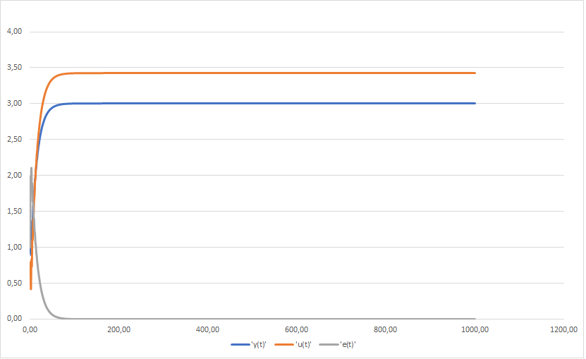
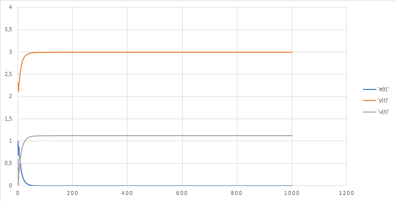

# Laboratory work #2

#### Student: Makarevich Maxim

###### Task 1. PID controller
In C ++, implement a program that simulates the PID controller discussed above.
Use the mathematical model obtained in the previous work as a control object.
Use OOP, the program must have at least 3 classes (+ inheritance).
The report also contains graphs for different tasks of the object temperature,
explain the results obtained (the report can be obtained using Doxygen in chm format).


##### Code:

```c++
#include <iostream>
#include <math.h>
#include <iomanip>

using namespace std;

class model
{
public:
    virtual float equation(float yt, float ut) = 0;
};

class linear : public model
{
private:
    float a, b, yt1;
public:
    linear(float a, float b)
    {
        this->a = a;
        this->b = b;
    }

    float equation(float yt, float ut)
    {
        yt1 = a * yt + b * ut;
        return yt1;
    }
};

class nonlinear : public model
{
private:
    float a, c, d, b;
    float yt0 = 0, yt1;
    float ut0 = 0;
public:
    nonlinear(float a, float b, float c, float d)
    {
        this->a = a;
        this->b = b;
        this->c = c;
        this->d = d;
    }

    float equation(float yt, float ut)
    {
        yt1 = a * yt - b * pow(yt0, 2) + c * ut + d * sin(ut0);
        ut0 = ut;
        yt0 = yt;
        yt = yt1;
        return yt1;
    }
};

class regulator
{
private:
    float T, T0, TD, K, yt1 = 0;
public: 
    regulator(float T, float T0, float TD, float K) {
        this->T = T;
        this->T0 = T0;
        this->TD = TD;
        this->K = K;
    }
    
    float warm(float e, float em1, float em2) {
        float q0 = K * (1 + TD / T0);
        float q1 = -K * (1 + 2 * TD / T0 - T0 / T);
        float q2 = K * TD / T0;
        yt1 += q0 * e + q1 * em1 + q2 * em2;
        return yt1;
    }
};
    void PIDregulator(float w, float y0, regulator *reg, model *md) {
        float e = 0, em1 = 0, em2 = 0, u = 0, y = y0;
        for (int i = 0; i < 100; i++) {
            e = w - y;
            u = reg->warm(e, em1, em2);
            y = md->equation(y0, u);
            cout << "E=" << e << " Y=" << y << " U=" << u << endl;
            em2 = em1;
            em1 = e;
        }
    }

int main()
{
    cout << "Linear Model:" << endl;
    linear* l = new linear(0.3, 0.7);
    regulator* rl = new regulator(10, 10, 50, 0.1);
    PIDregulator(3, 2, rl, l);
    cout << endl;
    cout << "NonLinear Model:" << endl;
    nonlinear* nl = new nonlinear(1, 0.003, 0.5, 0.5);
    regulator* rnl = new regulator(10, 10, 50, 0.1);
    PIDregulator(3, 2, rnl, nl);
    return 0;
}
```

##### Result:
T = 10, T0 = 10, TD = 50, K = 0.1 

linear equation (w = 3, a = 0.3, b = 0.7)
   <p>
    
</p>
linear equation (w = 8, a = 0.3, b = 0.7)
<p>
    
</p>
Nonlinear equation (w = 3, a = 1, b = 0.003, c = 0.5, d = 0.5)
<p>
    
</p>
Nonlinear equation (w = 8, a = 1, b = 0.003, c = 0.5, d = 0.5)
<p>
    
</p>
