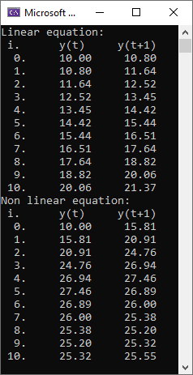

# Laboratory work 1
## Performed by Rakhlei Vitali

##### Task: Create a program, that simulates object with given equation.

Code:
    #include <iostream>
    #include <cmath>
    #include <iomanip>

    void linear_equation(const double& a, const double& b, const double& u_t, const double& y_t);

    void non_linear_equation(const double &a, const double &b, const double &c, const double &d, const double &u_t, const double &y_t);

    void input(double& a, double& b, double& c, double& d, double& u_t, double& y_t);

    int main()
    {
        double  a = 1.05,
                b = 0.01, 
                c = 0.2, 
                d = 0.7, 
                u_t = 30, 
                y_t = 10;

        /*std::cout << "Do you want to change parameters: y or n\n";
        switch (getchar())
        {
            case 'y':
                input(a, b, c, d, u_t, y_t); //can be not a function but i thought it would be prettier
                break;
            default:
                std::cout << "Understandable. Have a nice day!\n";
                break;
        }*/

        std::cout << "Linear equation:" << std::endl;
        linear_equation(a, b, u_t, y_t);

        std::cout << "Non linear equation:" << std::endl;
        non_linear_equation(a, b, c, d, u_t, y_t);

        return 0;
    }

    void linear_equation(const double& a, const double& b, const double& u_t, const double& y_t)
    {
        double _y_t = y_t;
        std::cout << std::setw(3) << " i." << std::setw(10) << "y(t)" << std::setw(12) << "y(t+1)\n";
        for (char i = 0; i <= 10; ++i)
        {
            double y_t1 = a * _y_t + b * u_t;

            std::cout <<  std::fixed << std::setprecision(2) << std::setw(3) << (int)i << "." << std::setw(10) << _y_t << std::setw(10) << y_t1 << "\n";

            _y_t = y_t1;
        }
    }

    void non_linear_equation(const double& a, const double& b, const double& c, const double& d, const double& u_t, const double& y_t)
    {
        double _y_t = y_t;
        double y_t0 = 0;
        std::cout << std::setw(3) << " i." << std::setw(10) << " y(t)" << std::setw(12) << "y(t+1)\n";

        for (char i = 0; i <= 10; ++i)
        {
            double y_t1 = a * _y_t - b * y_t0 * y_t0 + c * u_t + d * sin(u_t);

            std::cout << std::fixed << std::setprecision(2) << std::setw(3) << (int)i << "." << std::setw(10) << _y_t << std::setw(10) << y_t1 << "\n";

            y_t0 = _y_t;
            _y_t = y_t1;
        }
    }

    void input(double& a, double& b, double& c, double& d, double& u_t, double& y_t)
    {
        std::cin >> a >> b >> c >> d >> u_t >> y_t;
    }

