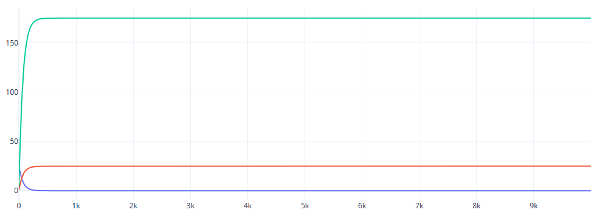
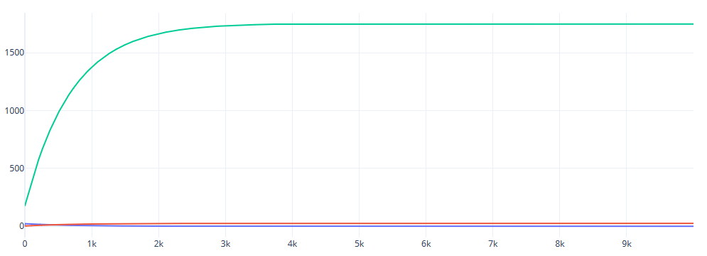
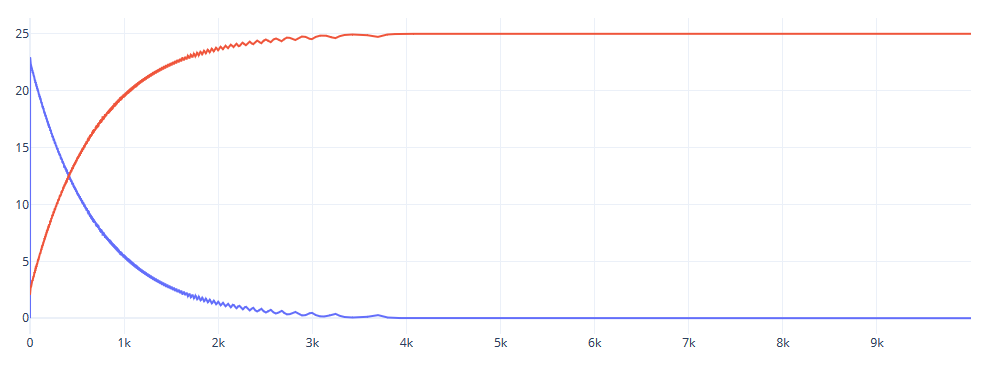

# Laboratory work 2

## Performed by Rakhlei Vitali

### Task: PID Controller.


## Code:

#### main.cpp

```c++
#include <iostream>
#include <cmath>
#include <iomanip>
#include "model.h"

/**
*       \file Main function file.
*       \author Rakhlei Vitali.
*       \brief Main project logic.
* 
*       This file contains main project structure and logic of model implementation.
*/
int main()
{
    double  a = 0.3, //0.3
        b = 0.0001,  //0.1
        b1 = 0.1,
        c = 0.01,  //0.1
        d = 0.1,  //0.1
        u_t = 25, //30
        y_t = 1,  //4
        k = 0.1,  //0.1
        t = 10,   //1
        tq = 10,//0.01
        td = 50;  //50

    model *newModel = new model(u_t, y_t, tq);

    linear *ccol = new linear(a, b1, c, d, y_t);
    nonlinear* cconl = new nonlinear(a, b, c, d, y_t);
    regulator *cr = new regulator(tq, k, t, td);

    newModel->initmodules(ccol, cconl, cr);
    newModel->active();
 
    delete newModel;
    cout << "Success" << endl;
    return 0;
}
```

#### controlobject.h [[full](https://github.com/as005411/MMIPU-2020/tree/dev/trunk/as005411/task_02/doc/add#controlobjectcpp-return)]:

```c++
#ifndef CONTROLOBJECT_H
#define CONTROLOBJECT_H
#include <iostream>

/**
*       \brief Abstract class that contains common controlled object logic.
*
*       This class contains common variables and methods(mostly abstract) with some additional useful logic such as copyconstructors and other.
*/
class controlobject
{
protected:
    double a, b, c, d, y; //<! Common variables for both linear and nonlinear controlled objects
public:
    /**
    *   Constructor for controlled object. Initializes needed variables and stuff.
    */
    controlobject(const double& ia, const double& ib, const double& ic, const double& id, const double& iy);
    controlobject& operator=(const controlobject*& other);
    controlobject(controlobject*& other);
    /**
    *   Common pure virtual method with slightly different logic for linear and nonlinear objects.
    */
    virtual double &eq(const double &iu) = 0;
};

#endif // CONTROLOBJECT_H
```

#### linear.h [[full](https://github.com/as005411/MMIPU-2020/tree/dev/trunk/as005411/task_02/doc/add#linearcpp-return)]:

```c++
#ifndef LINEAR_H
#define LINEAR_H
#include "controlobject.h"

/**
*       \brief Linear controlled object logic.
* 
*       Class that contains linear controlled object logic.
*/
class linear : protected controlobject
{
public:
    /**
    *   Constructor for linear controlled object. Initializes needed variables and stuff.
    */
    linear(const double &ia, const double &ib, const double &ic, const double &id, const double &iy);
    /**
    *   Method that contains primary logic of linear controlled object.
    */
    double &eq (const double &iu) override;
};

#endif // LINEAR_H
```

#### nonlinear.h [[full](https://github.com/as005411/MMIPU-2020/tree/dev/trunk/as005411/task_02/doc/add#nonlinearcpp-return)]:

```c++
#ifndef NONLINEAR_H
#define NONLINEAR_H
#include "controlobject.h"
#include <cmath>

/**
*       \brief Noninear controlled object logic.
* 
*       Class that contains nonlinear controlled object logic.
*/
class nonlinear : public controlobject
{
private:
    double prevu = 0, prevy = 0, ycache = 0; //<! Variables specific for nonlinear logic.
public:
    /**
    *   Constructor for nonlinear controlled object. Initializes needed variables and stuff.
    */
    nonlinear(const double &ia, const double &ib, const double &ic, const double &id, const double &iy);
    /**
    *   Method that contains primary logic of nonlinear controlled object.
    */
    double &eq (const double &iu) override;
};

#endif // NONLINEAR_H

```

#### regulator.h [[full](https://github.com/as005411/MMIPU-2020/tree/dev/trunk/as005411/task_02/doc/add#regulatorcpp-return)]:

```c++
#ifndef REGULATOR_H
#define REGULATOR_H

/**
*       \brief Regulator logic class.
* 
*       This class contains Regulator logic.
*/
class regulator
{
private:
    const double k, t, td, t0; //<! Bunch of constants for regulator.
    double uk = 0, ek1 = 0, ek2 = 0; //<! Vitals of all calculations.
    double q0, q1, q2; //<! Also constants for work.
public:
    /** 
    *   Constructor for unspecified variables.
    */
    regulator(const double &qt);
    /**
    *   Constructor for only K variable specified.
    */
    regulator(const double &qt, const double &ik);
    /**
    *   Constructor for variables K and T specified.
    */
    regulator(const double &qt, const double &ik, const double &it);
    /**
    *   Constructor for all variables specified. It also calculates all consts in process.
    */
    regulator(const double &qt, const double &ik, const double &it, const double &itd);
    /**
    *   \brief Primary regulator logic function.
    * 
    *   This function contains primary logic with needed value returned.
    *   \param iek Input value e(k)
    */
    double &eq(const double &iek);
};

#endif // REGULATOR_H

```

#### model.h [[full](https://github.com/as005411/MMIPU-2020/tree/dev/trunk/as005411/task_02/doc/add#modelcpp-return)]:

```c++
#ifndef REGULATOR_H
#define REGULATOR_H

/**
*       \brief Regulator logic class.
* 
*       This class contains Regulator logic.
*/
class regulator
{
private:
    const double k, t, td, t0; //<! Bunch of constants for regulator.
    double uk = 0, ek1 = 0, ek2 = 0; //<! Vitals of all calculations.
    double q0, q1, q2; //<! Also constants for work.
public:
    /** 
    *   Constructor for unspecified variables.
    */
    regulator(const double &qt);
    /**
    *   Constructor for only K variable specified.
    */
    regulator(const double &qt, const double &ik);
    /**
    *   Constructor for variables K and T specified.
    */
    regulator(const double &qt, const double &ik, const double &it);
    /**
    *   Constructor for all variables specified. It also calculates all consts in process.
    */
    regulator(const double &qt, const double &ik, const double &it, const double &itd);
    /**
    *   \brief Primary regulator logic function.
    * 
    *   This function contains primary logic with needed value returned.
    *   \param iek Input value e(k)
    */
    double &eq(const double &iek);
};

#endif // REGULATOR_H

```


### [Doxygen documentation](doxy#summary)

## Result:

#### Linear:

​    

#### Non-linear full:



#### Non-linear bottom part:

