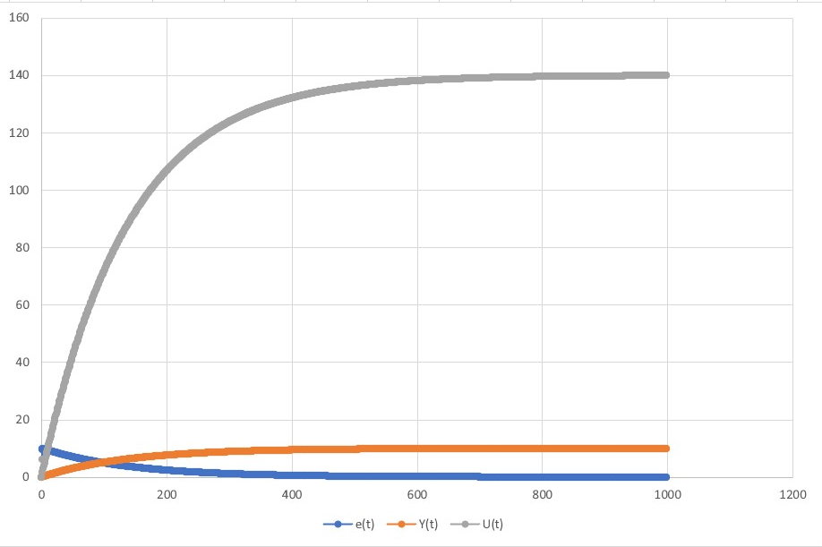
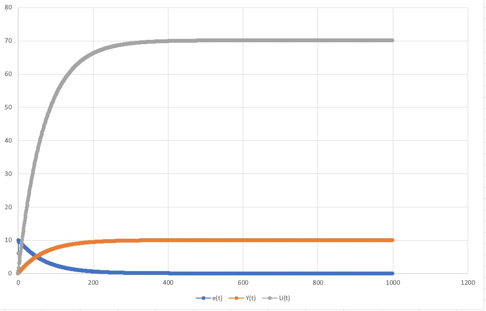
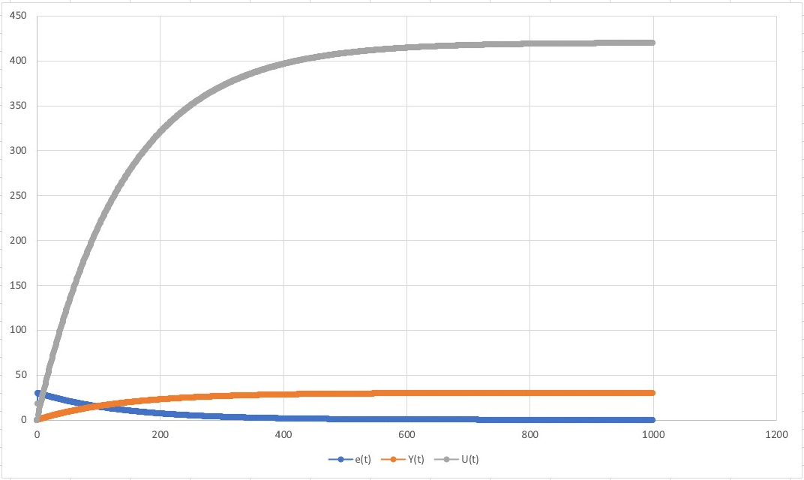
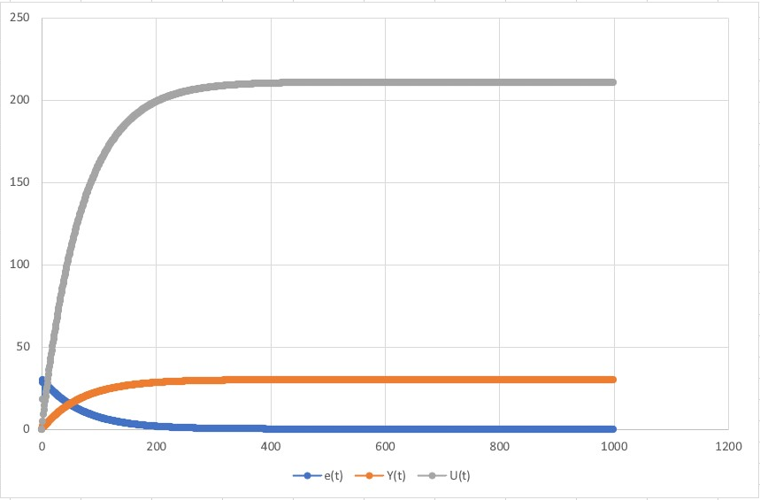

# Laboratory work #2

### Student: Shestakov Mark

##### Task 1. PID Controller

Write program (C++), that models PID - controller.

PID - controller:

<p align="center">
    
</p>

##### Code:

```c++
#include <iostream>
#include <cmath>
#include <fstream>

using std::cout;

/**
    \brief class that implements Object of Control

	abstract class to set needed functions
*/

class Model
{
public:
    /*!
        abstract function to override in child classes
        \param y_t output of Regulator
        \param u_t input of Regulator
    */
    virtual double equation(double u_t, double y_t) = 0;
};


/*!
    \brief class that implements Object of Control

    this class extends parent class Model and implements Linear Model
*/
class Linear_Model : public Model
{
private:
    double a, b;
public:
    /*!
        Constructor for NonLinearModel class
        \param a,b coefficients
    */
    Linear_Model(double a, double b)
    {
        this->a = a;
        this->b = b;
    }
    /*!
        it calculate Yt via linear method
        \param y_t output of Regulator
        \param u_t input of Regulator
        \return input parameter to Object of Control Yt
    */
    double equation(double u_t, double y_t) override
    {
        return a * y_t + b * u_t;
    }
};

/*!
    \brief class that implements Object of Control

    this class extends parent class Model and implements Nonlinear Model
*/
class Non_Linear_Model : public Model
{
private:
    double a, b, c, d;
    double u_t0 = 0, y_t0 = 0;
public:

    /*!
        Constructor for NonLinearModel class
        \param a,b,c,d coefficients
    */
    Non_Linear_Model(double a, double b, double c, double d)
    {
        this->a = a;
        this->b = b;
        this->c = c;
        this->d = d;
    }
    /*!
        it calculate Yt via nonlinear method
        \param y_t output of Regulator
        \param u_t input of Regulator
        \return input parameter to Object of Control Yt
    */
    double equation(double u_t, double y_t) override
    {
        double y_t1 = a * y_t - b * pow(y_t0, 2) + c * u_t + d * sin(u_t0);
        y_t0 = y_t;
        u_t0 = u_t;
        return y_t1;
    }
};

/*!
    \brief class that implements Regulator Gr
*/
class Regulator
{
private:
    double K, T, TD, T0;
    double u_t = 0.0;
public:
    /*!
        Constructor for Regulator class
        \param K,T0,TD,T coefficients
    */
    Regulator(double K, double T, double TD, double T0)
    {
        this->K = K;
        this->T = T;
        this->TD = TD;
        this->T0 = T0;
    }

    /*!
        \brief function that calculate u(t) and returns it
        \param e,e_0,e_00 values of current, previous and the before previous one errors
        \return u_t u(t)
    */
    double get_U_t(double e, double e_0, double e_00)
    {
        double q0 = K * (1 + TD / T0);
        double q1 = -K * (1 + (2 * TD / T0) - (T0 / T));
        double q2 = K * TD / T0;

        u_t += q0 * e + q1 * e_0 + q2 * e_00;

        return u_t;
    }

    /*!
    \brief function that models PID controller
    \param w some desired value
    \param *model pointer on some Model instance
    \param y_t initial value of Yt
*/
    void Start_PID_Regulator(double w, Model* model, double y_t)
    {
        std::ofstream file;
        file.open("file.csv");

        double e = 0.0, e_0 = 0.0, e_00 = 0.0;

        for (int i = 0; i < 1000; i++)
        {
            cout  << e << " " << y_t << " " << u_t << "\n";

            file << i << "," << e << "," << y_t << "," << u_t << "\n";

            e = w - y_t;
            get_U_t(e, e_0, e_00);
            y_t = model->equation(u_t, y_t);

            e_00 = e_0;
            e_0 = e;
        }

        file.close();
    }
};

int main()
{
    Regulator* regulator = new Regulator(0.1, 10.0, 50.0, 10.0);
    Linear_Model* linear_model = new Linear_Model(0.3, 0.05);
    regulator->Start_PID_Regulator(30, linear_model, 0);

    cout << "\n\n";

    Regulator* regulator2 = new Regulator(0.1, 10.0, 50.0, 10.0);
    Non_Linear_Model* non_linear_model = new Non_Linear_Model(0.3, 0.0001, 0.1, 0.0001);
    regulator2->Start_PID_Regulator(30, non_linear_model, 0);

    return 0;
}
```

##### Result:

1) Linear graph with wt = 10

<p align="center">
       
2) NonLinear graph with wt = 10

<p align="center">
       
3) Linear graph with wt = 30

<p align="center">
       
4) NonLinear graph with wt = 30

<p align="center">
       