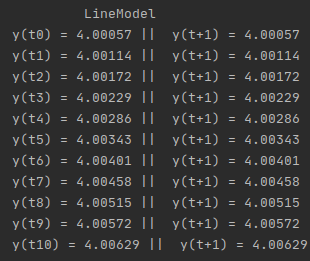
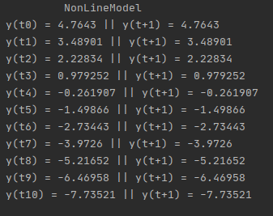

**Student: Branchuk Dima AS-53**
_Task 1.
Modeling controlled object. Write program (C++). With help Linear and Nonlinear models.
alt text_

**Program code:**

#include <iostream>
#include "cmath"
using namespace std;
void LineModel(float a, float b, float y1, float y2);
void NonLineModel(float a, float b, float c, float d, float y1, float y2);

int main()
{
    LineModel(1,0.0011,0.52,4);
    NonLineModel(1,0.0011,0.52,4,5,6);
    return 0;
}

void LineModel(float a, float b, float y1, float y2)
{
    cout << "\t\t LineModel" << endl;
    float yt;
    for(int i = 0; i <=10; ++i)
    {
        yt = a * y2 + b * y1;
        y2 = yt;
        cout << "y(t" << i << ") = " << y2 << " || "<< " y(t+1) = " << yt << endl;
    }
}

void NonLineModel(float a, float b, float c, float d, float y1, float y2)
{
    cout << "----------------------------" << endl;
    cout << "\t\t NonLineModel" << endl;
    float yt_1 = 0;
    float yt_2;
    for(int i = 0; i <= 10; ++i)
    {
        yt_2 = a * y2 - b * yt_1 * yt_1 + c * y1 + d * sin(y1);
        yt_1 = y2;
        y2 = yt_2;
        cout << "y(t"<<i<<")"<<" = " << y2 << " || "<< "y(t+1) = " << yt_2 << endl;
    }
}

###### **Result:**

**_LineModel_**

**_NonLineModel_**

